# PROJECT_HANDOFF.md — מסמך העברת פרויקט

> **מסמך זה נכתב עבור מודל שפה שימשיך את הפיתוח (ChatGPT או אחר).**
> המטרה: להעביר את מלוא הידע על הפרויקט ללא אובדן מידע, כך שניתן יהיה להמשיך לפתח
> מבלי לקרוא את כל הקוד מאפס.
>
> **תאריך עדכון אחרון:** 1 באוגוסט 2026
> **גרסה מתועדת:** 1.0.0
> **נכתב על ידי:** Claude (Fable 5 / Opus 5), בסביבת Claude Code
>
> ### כלל אמינות למי שקורא את המסמך
> המסמך מבחין בקפדנות בין **מה שקיים בקוד** לבין **מה שמתוכנן**. כל סעיף שמתאר יכולת
> שאינה קיימת מסומן במפורש ב‑`❌ לא קיים`. אל תניח קיום של רכיב רק משום שהוא מוזכר.

---

## תוכן עניינים

| # | סעיף |
|---|---|
| 1 | [סקירת הפרויקט](#1-סקירת-הפרויקט) |
| 2 | [מבנה תיקיות](#2-מבנה-תיקיות) |
| 3 | [Stack](#3-stack) |
| 4 | [רשימת Packages](#4-רשימת-packages) |
| 5 | [Architecture](#5-architecture) |
| 6 | [כל המסכים](#6-כל-המסכים) |
| 7 | [Components](#7-components) |
| 8 | [Services](#8-services) |
| 9 | [GitHub](#9-github) |
| 10 | [TODO](#10-todo) |
| 11 | [Known Bugs](#11-known-bugs) |
| 12 | [Performance](#12-performance) |
| 13 | [Mobile](#13-mobile) |
| 14 | [Security](#14-security) |
| 15 | [AI Roadmap](#15-ai-roadmap) |
| 16 | [Design System](#16-design-system) |
| 17 | [UX Review](#17-ux-review) |
| 18 | [קבצים חשובים](#18-קבצים-חשובים) |
| 19 | [Context](#19-context) |
| 20 | [הצעות לשיפור](#20-הצעות-לשיפור) |

---

## 1. סקירת הפרויקט

### שם הפרויקט

**עוזר הקניות החכם** (Smart Shopping Assistant)
מזהה חבילה: `smart-shopping-assistant`
שם תצוגה בממשק: "עוזר הקניות החכם"

### מטרת המערכת

המערכת נועדה לענות על שאלה אחת שקשה לענות עליה ידנית:

> **"איפה הכי כדאי לי לקנות את המוצר הזה — בהתחשב בכל העלויות ולא רק במחיר המדבקה?"**

רוב משווי המחירים מציגים מחיר בסיס בלבד. המערכת הזו מחשבת **עלות כוללת אמיתית**
(מחיר + משלוח + מס יבוא משוער) ומשקללת אותה יחד עם ארבעה ממדים נוספים שמשפיעים על
"האם העסקה טובה": אמינות הספק, מהירות אספקה, איכות האחריות ומדיניות ההחזרות.

עקרונות מנחים שהוטמעו במוצר:

1. **ספקים מהימנים בלבד.** ספק חסום לא מופיע בתוצאות — נקודה. אין "אזהרה קטנה ליד
   הצעה זולה". המערכת מסננת ומדווחת כמה הצעות סוננו.
2. **עלות כוללת, לא מחיר.** מוצר ב‑890 ₪ מסין עם 45 ₪ משלוח ו‑150 ₪ מס = 1,085 ₪,
   ולא "890 ₪". המערכת מציגה את שני המספרים אך מדרגת לפי הכולל.
3. **הדירוג שקוף וניתן לכוונון.** המשתמש רואה את פירוק הציון לחמישה ממדים ויכול לשנות
   את המשקולות בהגדרות. אין "אלגוריתם קסם".
4. **הכול מתועד.** כל חיפוש, השוואה, מעקב, התראה ועדכון ספק נרשם ביומן פעילות.

### מצב נוכחי

**גרסה 1.0.0 — אפליקציית Frontend מלאה ופרוסה, הרצה על נתוני דמו.**

* ✅ הקוד בנוי, עובר `tsc` ב‑strict mode ללא שגיאות, ועובר `vite build` נקי.
* ✅ נבדק בדפדפן אמיתי (Chromium דרך Playwright) ב‑3 רזולוציות ובשני מצבי תצוגה,
  ללא שגיאות JavaScript.
* ✅ פרוס וחי בכתובת ציבורית.
* ❌ **אין Backend.** כל הנתונים מגיעים ממודול mock מקומי.
* ❌ **אין בסיס נתונים, אין אימות משתמשים, אין שרת.**

### כתובות

| מה | איפה |
|---|---|
| אתר חי (ציבורי) | https://avi7756-design.github.io/mind-space/shopping/ |
| Repository | `avi7756-design/mind-space` |
| ענף קוד מקור | `claude/shopping-assistant-app-139m55` |
| נתיב קוד המקור | `shopping-assistant/` |
| נתיב הגרסה הבנויה (בענף `main`) | `shopping/` |

### מה כבר עובד

רשימה זו כוללת **רק** יכולות שנבדקו בפועל בדפדפן:

| # | יכולת | סטטוס |
|---|---|---|
| 1 | חיפוש מוצר בשפה חופשית מהסרגל העליון (גלובלי, מכל מסך) | ✅ עובד |
| 2 | חיפוש מוצר מטופס החיפוש בעמוד ההשוואה | ✅ עובד |
| 3 | קטלוג מובנה ל‑5 מוצרים נפוצים (אוזניות, אייפון, מכונת קפה, טלוויזיה, שואב רובוטי) | ✅ עובד |
| 4 | גנרטור דטרמיניסטי לכל שאילתה אחרת (אותה שאילתה → אותן תוצאות תמיד) | ✅ עובד |
| 5 | חישוב עלות כוללת = מחיר בסיס + משלוח + מס משוער | ✅ עובד |
| 6 | מנוע דירוג משוקלל עם 5 ממדים ונרמול בתוך סט ההשוואה | ✅ עובד |
| 7 | שלושה מצבי דירוג: תמורה / מחיר כולל / אמינות | ✅ עובד |
| 8 | סינון תוצאות: זמן אספקה, החזרה חינם, במלאי בלבד | ✅ עובד |
| 9 | כרטיס "ההמלצה המובילה" עם פירוק ציון ויזואלי (5 ScoreBars) | ✅ עובד |
| 10 | טבלת השוואה מלאה עם 11 עמודות + הדגשת המנצח בכתר | ✅ עובד |
| 11 | סינון אוטומטי של הצעות מספקים חסומים + באנר "N הצעות סוננו" | ✅ עובד |
| 12 | מאגר 10 ספקים עם ציון אמינות, אימות, דירוג, ותק ודגלי סיכון | ✅ עובד |
| 13 | החרגת ספק ידנית / ביטול החרגה, עם רישום ביומן | ✅ עובד |
| 14 | סינון תצוגת ספקים: הכול / פעילים / מוחרגים | ✅ עובד |
| 15 | הוספת הצעה למעקב מחירים ישירות מטבלת ההשוואה | ✅ עובד |
| 16 | גרף היסטוריית מחיר עם קו יעד (Recharts AreaChart) | ✅ עובד |
| 17 | עריכת מחיר יעד inline עם שמירה ב‑Enter | ✅ עובד |
| 18 | הסרה מרשימת המעקב | ✅ עובד |
| 19 | הדמיית סבב עדכון מחירים ("בדיקת מחירים עכשיו") | ✅ עובד |
| 20 | הדמיית רענון ציוני אמינות ("רענון ציוני אמינות") | ✅ עובד |
| 21 | מנוע התראות: חצייה של מחיר יעד + ירידה של 5%+ | ✅ עובד |
| 22 | מנוע התראות: שינוי בציון אמינות ספק | ✅ עובד |
| 23 | מרכז התראות עם סינון לפי סוג + תצוגת ערוצים פעילים | ✅ עובד |
| 24 | יומן פעילות עם 6 סוגי רשומות וסינון | ✅ עובד |
| 25 | דשבורד עם 4 כרטיסי KPI מחושבים מנתונים אמיתיים | ✅ עובד |
| 26 | הגדרות משקולות עם 5 מחוונים ואימות סכום = 100% | ✅ עובד |
| 27 | הגדרות ערוצי התראה (אימייל / טלגרם / Webhook) | ✅ עובד |
| 28 | איפוס נתוני דמו | ✅ עובד |
| 29 | ייצוא CSV אמיתי עם BOM (נפתח נכון בעברית באקסל) | ✅ עובד |
| 30 | מצב כהה עם החלפה מיידית ושמירה בין סשנים | ✅ עובד |
| 31 | RTL מלא בכל המסכים | ✅ עובד |
| 32 | תצוגה רספונסיבית (נבדק ב‑390px, 1440px) | ✅ עובד |
| 33 | תפריט צד נשלף במובייל עם overlay | ✅ עובד |
| 34 | שמירת מצב מלאה ב‑localStorage (zustand persist) | ✅ עובד |
| 35 | Empty states מעוצבים בכל מסך שיכול להיות ריק | ✅ עובד |

### מה עדיין חסר

| # | מה חסר | חומרה | הערה |
|---|---|---|---|
| 1 | Backend / API אמיתי | 🔴 Critical | הממשק מוכן (`SupplierDataProvider`), המימוש חסר |
| 2 | סקרייפר / ספק נתוני מחירים | 🔴 Critical | ללא זה המערכת היא דמו בלבד |
| 3 | בסיס נתונים | 🔴 Critical | כרגע `localStorage` בלבד |
| 4 | אימות משתמשים | 🔴 Critical | אין מושג של "משתמש" בקוד |
| 5 | שליחת התראות בפועל | 🔴 Critical | המנוע מייצר רשומות, אף אחד לא שולח אותן |
| 6 | Job מתוזמן לבדיקת מחירים | 🟠 High | כרגע רק כפתור ידני |
| 7 | ייצוא PDF | 🟠 High | placeholder שמחזיר הודעה |
| 8 | בדיקות אוטומטיות (unit / e2e) | 🟠 High | **אפס בדיקות בפרויקט** |
| 9 | טיפול בשגיאות ברשת + Error Boundary | 🟠 High | קריטי ברגע שיש API אמיתי |
| 10 | היסטוריית ציוני אמינות (timeline) | 🟡 Medium | יש רק ערך נוכחי |
| 11 | תמיכה במטבעות מרובים | 🟡 Medium | הטיפוס נעול ל‑`'ILS'` |
| 12 | PWA (manifest + service worker) | 🟡 Medium | האפליקציה השנייה בריפו כן PWA |
| 13 | i18n / תמיכה בשפות נוספות | 🟢 Low | כל הטקסטים hardcoded בעברית |
| 14 | נגישות מלאה (ARIA, ניווט מקלדת) | 🟡 Medium | חלקי — פירוט בסעיף 17 |

---

## 2. מבנה תיקיות

### עץ מלא של קוד המקור

```
shopping-assistant/
│
├── .env.example                    # תבנית משתני סביבה (placeholders בלבד)
├── .gitignore                      # node_modules, dist, dist-artifact, .env, *.tsbuildinfo
├── README.md                       # תיעוד הפעלה ופריסה
├── PROJECT_HANDOFF.md              # ← המסמך הזה
├── ARCHITECTURE.md                 # תיעוד ארכיטקטורה מעמיק
├── AI_CONTEXT.md                   # הקשר ייעודי למודל שפה שממשיך
├── ROADMAP.md                      # מפת דרכים לגרסאות הבאות
├── FEATURE_MATRIX.md               # מטריצת יכולות: קיים / חלקי / חסר
├── CHANGELOG.md                    # יומן שינויים
│
├── index.html                      # נקודת כניסה HTML, dir="rtl" lang="he"
├── package.json                    # תלויות וסקריפטים
├── package-lock.json               # נעילת גרסאות מדויקת
│
├── vite.config.ts                  # תצורת בנייה ראשית (base:'./', manualChunks)
├── vite.singlefile.config.ts       # תצורה חלופית: בנייה לקובץ HTML יחיד
├── tsconfig.json                   # tsconfig שורש (project references)
├── tsconfig.app.json               # תצורת TS לקוד האפליקציה (strict)
├── tsconfig.node.json              # תצורת TS לקבצי הבנייה
├── tailwind.config.js              # ערכת עיצוב: צבעי brand, גופן, darkMode:'class'
├── postcss.config.js               # tailwindcss + autoprefixer
│
├── netlify.toml                    # תצורת פריסה ל-Netlify
├── vercel.json                     # תצורת פריסה ל-Vercel
│
├── SCREENSHOTS/                    # 17 צילומי מסך של כל המסכים
│   ├── README.md                   # אינדקס הצילומים
│   ├── 01-dashboard.png
│   ├── 02-search-empty.png
│   ├── 03-search-results.png
│   ├── 04-search-rank-price.png
│   ├── 05-suppliers.png
│   ├── 06-watchlist.png
│   ├── 07-alerts.png
│   ├── 08-activity.png
│   ├── 09-settings.png
│   ├── 10-dashboard-dark.png
│   ├── 11-search-results-dark.png
│   ├── 12-suppliers-dark.png
│   ├── 13-watchlist-dark.png
│   ├── 14-settings-dark.png
│   ├── 15-mobile-dashboard.png
│   ├── 16-mobile-watchlist.png
│   └── 17-mobile-sidebar.png
│
└── src/
    │
    ├── main.tsx                    # [13 שורות]  bootstrap: React root + HashRouter
    ├── App.tsx                     # [34 שורות]  הגדרת נתיבים + החלת theme על <html>
    ├── index.css                   # Tailwind directives + מחלקות עזר (.card/.btn/.input)
    ├── vite-env.d.ts               # [13 שורות]  טיפוסים ל-import.meta.env
    │
    ├── types/
    │   └── index.ts                # [129 שורות] כל טיפוסי הדומיין — מקור אמת יחיד
    │
    ├── data/
    │   └── seed.ts                 # [384 שורות] מאגר ספקים, קטלוג מוצרים, גנרטור, seed
    │
    ├── services/                   # שכבת לוגיקה טהורה — ללא React
    │   ├── api.ts                  # [59 שורות]  ממשק SupplierDataProvider + mock
    │   ├── scoring.ts              # [100 שורות] מנוע הדירוג המשוקלל
    │   ├── alerts.ts               # [83 שורות]  מנוע כללי ההתראות
    │   ├── export.ts               # [56 שורות]  ייצוא CSV + placeholder ל-PDF
    │   └── format.ts               # [40 שורות]  עיצוב מספרים/מטבע/תאריכים ב-he-IL
    │
    ├── store/
    │   └── useAppStore.ts          # [193 שורות] Zustand store יחיד + persist
    │
    ├── components/
    │   ├── layout/
    │   │   ├── AppLayout.tsx       # [20 שורות]  שלד: Sidebar + Topbar + Outlet
    │   │   ├── Sidebar.tsx         # [92 שורות]  ניווט צד + badge התראות + מובייל
    │   │   └── Topbar.tsx          # [51 שורות]  חיפוש גלובלי + כפתור מצב כהה
    │   │
    │   ├── ui/                     # רכיבי ממשק גנריים (presentational בלבד)
    │   │   ├── Badge.tsx           # [19 שורות]  תג צבעוני ב-5 גוונים
    │   │   ├── EmptyState.tsx      # [22 שורות]  מצב ריק עם אייקון + פעולה
    │   │   ├── KpiCard.tsx         # [45 שורות]  כרטיס מדד עם אייקון ומגמה
    │   │   ├── ScoreBar.tsx        # [17 שורות]  פס התקדמות לפירוק ציון
    │   │   ├── SectionHeader.tsx   # [19 שורות]  כותרת עמוד + פעולות
    │   │   └── TrustBadge.tsx      # [25 שורות]  תג אמינות + פונקציית trustTone
    │   │
    │   ├── charts/
    │   │   └── PriceHistoryChart.tsx  # [72 שורות] גרף מחיר עם קו יעד
    │   │
    │   └── compare/
    │       └── ComparisonTable.tsx    # [113 שורות] טבלת ההשוואה המרכזית
    │
    └── pages/                      # מסך אחד לכל נתיב
        ├── DashboardPage.tsx       # [202 שורות] /
        ├── SearchPage.tsx          # [302 שורות] /search      ← הקובץ המורכב ביותר
        ├── SuppliersPage.tsx       # [163 שורות] /suppliers
        ├── WatchlistPage.tsx       # [132 שורות] /watchlist
        ├── AlertsPage.tsx          # [139 שורות] /alerts
        ├── ActivityPage.tsx        # [88 שורות]  /activity   ← מייצא גם ACTIVITY_META
        └── SettingsPage.tsx        # [223 שורות] /settings
```

### סטטיסטיקה

| מדד | ערך |
|---|---|
| קבצי TypeScript/TSX | 29 |
| סך שורות קוד ב‑`src/` | **2,848** |
| רכיבי React | 17 |
| עמודים (routes) | 7 |
| שירותים (services) | 5 |
| Store יחיד | 1 |
| בדיקות אוטומטיות | **0** ⚠️ |

### תיקיות שנוצרות בבנייה (ב‑`.gitignore`)

```
node_modules/      # תלויות
dist/              # תוצר build רגיל  → זה מה שמועתק ל-shopping/ בענף main
dist-artifact/     # תוצר build לקובץ יחיד
*.tsbuildinfo      # cache של TypeScript
```

---

## 3. Stack

טבלה מדויקת. **`❌` = הרכיב אינו קיים בפרויקט כלל.**

| קטגוריה | מה בפועל | פירוט |
|---|---|---|
| **Framework** | **React 18.3.1** | Function components + Hooks בלבד. אין class components. אין Next.js, אין SSR — זו אפליקציית SPA סטטית טהורה. |
| **Language** | **TypeScript 5.9.3** | `strict: true`, `noUnusedLocals`, `noUnusedParameters`, `noFallthroughCasesInSwitch`. אין `any` מפורש בקוד. |
| **Bundler** | **Vite 5.4.21** | `@vitejs/plugin-react` 4.7.0. `base: './'` לנתיבים יחסיים. `manualChunks` לפיצול react/charts. |
| **CSS** | **Tailwind CSS 3.4.19** | `darkMode: 'class'`. PostCSS 8.5.25 + Autoprefixer 10.5.4. מחלקות עזר מותאמות ב‑`@layer components`. אין CSS Modules, אין styled-components. |
| **Icons** | **lucide-react 0.441.0** | כ‑35 אייקונים בשימוש. Tree-shakeable — רק מה שמיובא נכנס ל‑bundle. |
| **Database** | ❌ **אין** | המצב נשמר ב‑`localStorage` בלבד, תחת המפתח `shopping-assistant-store`, דרך `zustand/middleware persist`. אין PostgreSQL/Supabase/Firebase/IndexedDB. |
| **Hosting** | **GitHub Pages** (פעיל) | נפרס מענף `main`, תיקייה `shopping/`. תצורות מוכנות גם ל‑**Netlify** (`netlify.toml`) ול‑**Vercel** (`vercel.json`) — אך אלה **טרם חוברו**. |
| **API** | ❌ **אין API חיצוני** | קיים **ממשק** `SupplierDataProvider` ב‑`src/services/api.ts` עם מימוש `MockSupplierDataProvider` בלבד. אין `fetch` לשום כתובת חיצונית בכל הקוד. |
| **AI** | ❌ **אין** | אין קריאות למודל שפה, אין embeddings, אין vector DB. "חיפוש בשפה טבעית" מיושם כהתאמת מילות מפתח (`String.includes`) ולא כ‑NLP. ראו סעיף 15 לתוכנית ה‑AI. |
| **Authentication** | ❌ **אין** | אין מסך התחברות, אין JWT, אין session, אין מושג "משתמש" בטיפוסים. כל מי שנכנס לכתובת רואה את אותם נתוני דמו. |
| **Storage** | **localStorage** בלבד | אין העלאת קבצים, אין S3/Cloudinary, אין תמונות מוצר. ייצוא CSV מתבצע כ‑`Blob` בצד הלקוח דרך `URL.createObjectURL`. |
| **PWA** | ❌ **אין** | אין `manifest.webmanifest`, אין service worker, אין אייקונים. שימו לב: **האפליקציה השנייה באותו ריפו (mind-space) כן PWA** — אל תבלבלו ביניהן. |

### נקודה קריטית לגבי המחסנית

הפרויקט הוא **Frontend-only בכוונה תחילה**. זו לא השמטה — זו החלטה ארכיטקטונית:
כל שכבת הנתונים מבודדת מאחורי ממשק אחד, כדי שהוספת Backend לא תדרוש שכתוב UI.
ראו סעיף 5 ו‑19.

---

## 4. רשימת Packages

### תלויות ריצה (`dependencies`)

| חבילה | טווח ב‑package.json | גרסה מותקנת בפועל | תפקיד בפרויקט |
|---|---|---|---|
| `react` | `^18.3.1` | **18.3.1** | ספריית ה‑UI |
| `react-dom` | `^18.3.1` | **18.3.1** | רינדור ל‑DOM (`createRoot`) |
| `react-router-dom` | `^6.26.2` | **6.30.4** | ניתוב. משתמשים ב‑`HashRouter` (לא `BrowserRouter`) |
| `zustand` | `^4.5.5` | **4.5.7** | ניהול state גלובלי + middleware `persist` |
| `recharts` | `^2.12.7` | **2.15.4** | גרפים (`AreaChart`, `ResponsiveContainer`, `ReferenceLine`) |
| `lucide-react` | `^0.441.0` | **0.441.0** | אייקוני SVG |

### תלויות פיתוח (`devDependencies`)

| חבילה | טווח | גרסה מותקנת | תפקיד |
|---|---|---|---|
| `typescript` | `^5.5.4` | **5.9.3** | קומפיילר + בדיקת טיפוסים |
| `vite` | `^5.4.7` | **5.4.21** | dev server + bundler |
| `@vitejs/plugin-react` | `^4.3.1` | **4.7.0** | תמיכת React ב‑Vite (Fast Refresh) |
| `tailwindcss` | `^3.4.12` | **3.4.19** | מנוע ה‑CSS |
| `postcss` | `^8.4.47` | **8.5.25** | עיבוד CSS |
| `autoprefixer` | `^10.4.20` | **10.5.4** | תוספת prefixes לדפדפנים |
| `@types/react` | `^18.3.8` | **18.3.31** | טיפוסים ל‑React |
| `@types/react-dom` | `^18.3.0` | **18.3.7** | טיפוסים ל‑React DOM |

### חבילות שהותקנו זמנית ואינן ב‑`package.json`

| חבילה | למה שימשה | סטטוס |
|---|---|---|
| `playwright-core` | בדיקות דפדפן וצילומי מסך | הותקנה עם `--no-save`. **אינה תלות של הפרויקט.** |
| `vite-plugin-singlefile` | בניית קובץ HTML יחיד לשיתוף | הותקנה עם `--no-save`. נדרשת רק אם משתמשים ב‑`vite.singlefile.config.ts`. |

### מה **לא** נמצא בפרויקט (ובכוונה)

`axios` · `redux` · `react-query` / `tanstack-query` · `formik` / `react-hook-form` ·
`zod` / `yup` · `date-fns` / `moment` / `dayjs` · `lodash` · `framer-motion` ·
`shadcn/ui` / `radix-ui` / `mui` · `jest` / `vitest` / `testing-library` · `eslint` / `prettier`

**הסבר:** הפרויקט מכוון למינימום תלויות. `fetch` מובנה, `Intl` מובנה לתאריכים ומטבע,
Tailwind במקום ספריית רכיבים. ההיעדר של `eslint` ו‑`vitest` הוא **חוסר אמיתי** שיש
להשלים (ראו TODO), בעוד שאר ההיעדרים הם החלטה מכוונת.

### סקריפטים זמינים

```bash
npm run dev        # Vite dev server על http://localhost:5173
npm run build      # tsc -b && vite build  → dist/
npm run preview    # שרת מקומי לתוצר הבנייה
npm run typecheck  # בדיקת טיפוסים בלבד, ללא פלט
```

---

## 5. Architecture

### עיקרון־על: ארכיטקטורת שכבות עם תלות חד־כיוונית

```
┌──────────────────────────────────────────────────────────────────┐
│  שכבה 5 — PAGES        7 עמודים, אחד לכל נתיב                    │
│                        קוראים ל-store, מרכיבים components         │
└──────────────────────────────────────────────────────────────────┘
                                 ↓ תלוי ב
┌──────────────────────────────────────────────────────────────────┐
│  שכבה 4 — COMPONENTS   layout / ui / charts / compare            │
│                        רובם presentational (props → JSX)          │
└──────────────────────────────────────────────────────────────────┘
                                 ↓ תלוי ב
┌──────────────────────────────────────────────────────────────────┐
│  שכבה 3 — STORE        Zustand store יחיד + persist              │
│                        המקור היחיד לאמת של מצב האפליקציה          │
└──────────────────────────────────────────────────────────────────┘
                                 ↓ תלוי ב
┌──────────────────────────────────────────────────────────────────┐
│  שכבה 2 — SERVICES     scoring / alerts / export / format / api  │
│                        פונקציות טהורות. אפס ייבוא של React.       │
└──────────────────────────────────────────────────────────────────┘
                                 ↓ תלוי ב
┌──────────────────────────────────────────────────────────────────┐
│  שכבה 1 — TYPES + DATA  types/index.ts  ·  data/seed.ts          │
│                         חוזי הדומיין + נתוני הדמו                 │
└──────────────────────────────────────────────────────────────────┘
```

**כלל ברזל:** שכבה נמוכה **לעולם** לא מייבאת משכבה גבוהה.
`services/scoring.ts` לא יודע ש‑React קיים. זה מה שהופך אותו לנייד ולבדיק.

### זרימת מידע — מסלול מלא של חיפוש

זהו המסלול המרכזי במערכת. שווה להבין אותו לעומק לפני שינוי כלשהו.

```
  1. משתמש מקליד "אוזניות Sony" ולוחץ Enter
     └─ Topbar.tsx  →  navigate('/search?q=אוזניות Sony')

  2. SearchPage קורא את הפרמטר
     └─ const urlQuery = useSearchParams().get('q')
     └─ useEffect מזהה urlQuery !== searched  →  runSearch(urlQuery)

  3. שליפת נתונים דרך הממשק (הנקודה היחידה שתוחלף ב-Backend)
     └─ getSupplierDataProvider().searchOffers(query)
        └─ MockSupplierDataProvider:
           ├─ delay(600–1100ms)          ← הדמיית latency רשת
           └─ generateOffersForQuery(q)
              ├─ findCatalogEntry(q)  →  התאמת מילות מפתח
              │  └─ נמצא?  →  החזרת הצעות מהקטלוג המובנה
              └─ לא נמצא?  →  גנרטור דטרמיניסטי:
                 hashString(q) → mulberry32(seed) → הצעות יציבות

  4. שמירת התוצאות הגולמיות ב-state מקומי
     └─ setOffers(results)        ← Offer[] , ללא ציונים

  5. תיעוד ביומן
     └─ store.recordSearch(q, offerCount, supplierCount)
        └─ מוסיף ל-searchHistory + כותב ActivityEntry

  6. חישוב ציונים  [useMemo]
     └─ scoreOffers(offers, suppliers, weights)
        ├─ סינון: ספקים עם excluded === true יוצאים מהמשחק
        ├─ חישוב totalCost = basePrice + shippingCost + taxEstimate
        ├─ מציאת min/max של: עלות, זמן אספקה, אחריות
        ├─ נרמול כל ממד ל-0..100 בתוך הסט:
        │   ├─ עלות     → lowerIsBetter   (הזול ביותר = 100)
        │   ├─ אמינות   → supplier.trustScore  (מוחלט, לא מנורמל!)
        │   ├─ משלוח    → lowerIsBetter   (המהיר ביותר = 100)
        │   ├─ אחריות   → higherIsBetter  (הארוכה ביותר = 100)
        │   └─ החזרות   → returnPolicyQuality (ימים/30 × מקדם עלות)
        └─ ציון סופי = Σ(ממד × משקל) / Σ(משקולות)

  7. סינון לפי בחירת המשתמש  [useMemo]
     └─ maxDeliveryDays / freeReturnsOnly / inStockOnly

  8. מיון לפי מצב הדירוג  [useMemo]
     └─ rankOffers(list, 'value' | 'price' | 'trust')

  9. רינדור
     ├─ כרטיס "ההמלצה המובילה"  →  filtered[0] + 5× ScoreBar
     └─ ComparisonTable          →  filtered, bestOfferId

 10. פעולה אופציונלית: הוספה למעקב
     └─ store.addToWatchlist({...})
        ├─ יוצר WatchlistItem עם היסטוריה בת נקודה אחת
        ├─ כותב ActivityEntry מסוג 'track'
        └─ persist → localStorage
```

### State Management

**החלטה: Zustand עם store יחיד. לא Redux, לא Context מרובה.**

הנימוק: האפליקציה קטנה (2,848 שורות), אין מצב מקונן עמוק, ואין צורך ב‑middleware
מורכב. Zustand נותן שלושה דברים שהיו הכרחיים:

1. **selectors עדינים** — `useAppStore(s => s.watchlist)` מרנדר מחדש רק כשהמעקב
   משתנה, לא כשההתראות משתנות. עם Context זה היה דורש פיצול ידני.
2. **persist מובנה** — שורה אחת של תצורה שומרת את כל המצב ב‑localStorage.
3. **גישה מחוץ ל‑React** — `get()` בתוך actions מאפשר קומפוזיציה של פעולות
   (למשל `addToWatchlist` שקורא ל‑`logActivity`).

#### חלוקת State: גלובלי מול מקומי

| נשמר ב‑Store הגלובלי (persisted) | נשמר ב‑`useState` מקומי (נדיף) |
|---|---|
| `theme` — מצב תצוגה | תוצאות חיפוש (`offers`) |
| `weights` — משקולות דירוג | טקסט בתיבת החיפוש (`input`) |
| `alertChannels` — ערוצי התראה | מצב טעינה (`loading`) |
| `suppliers` — מאגר ספקים | מצב דירוג נבחר (`rankMode`) |
| `watchlist` — רשימת מעקב | ערכי סינון (`maxDeliveryDays` ועוד) |
| `alerts` — התראות | טיוטת הגדרות (`draftWeights`) |
| `activity` — יומן פעילות | הודעת toast |
| `searchHistory` — 10 חיפושים אחרונים | עריכת מחיר יעד (`editingId`) |

**הכלל:** מה שהמשתמש יצפה למצוא אחרי רענון הדף → גלובלי. מה ששייך לרגע → מקומי.
**תוצאות חיפוש הן מכוון מקומיות** — הן נגזרות מהשאילתה ולא ראוי לשמור אותן.

#### 15 ה‑Actions ב‑Store

| Action | מה עושה | כותב ליומן? |
|---|---|---|
| `toggleTheme()` | מחליף בהיר/כהה | ❌ |
| `setWeights(w)` | מעדכן משקולות | ✅ settings |
| `setAlertChannels(c)` | מעדכן ערוצים | ✅ settings |
| `logActivity(type, msg)` | מוסיף רשומה ליומן (חתוך ל‑200) | — |
| `recordSearch(q, n, m)` | היסטוריית חיפוש + יומן | ✅ search |
| `recordComparison(q, top, n)` | יומן בלבד | ✅ compare |
| `addToWatchlist(item)` | מוסיף מוצר למעקב | ✅ track |
| `removeFromWatchlist(id)` | מסיר ממעקב | ✅ track |
| `setTargetPrice(id, p)` | משנה מחיר יעד | ❌ ⚠️ |
| `setSupplierExcluded(id, x, r)` | חוסם/משחרר ספק | ✅ supplier_update |
| `simulatePriceUpdates()` | מדמה סבב polling + מפעיל התראות | ✅ track + alert |
| `simulateTrustUpdate()` | מדמה שינוי ציון אמינות | ✅ supplier_update |
| `resetDemoData()` | מאפס לנתוני seed | ❌ ⚠️ |

⚠️ שני ה‑actions המסומנים **אינם** כותבים ליומן — חוסר עקביות שכדאי לתקן (ראו באגים).

### Data Flow — שלושה דפוסים

**דפוס א׳: קריאה** — `Component → useAppStore(selector) → render`
פשוט וישיר. אין props drilling; כל רכיב שצריך נתון קורא אותו ישירות מה‑store.

**דפוס ב׳: כתיבה** — `Component → store.action() → set() → re-render + persist`
רכיבים לעולם לא משנים state ישירות. רק דרך actions.

**דפוס ג׳: חישוב נגזר** — `useMemo(() => pureFunction(state), [deps])`
ציונים, סינון ומיון **אינם נשמרים ב‑state**. הם מחושבים מחדש בכל שינוי.
זה מונע חוסר סנכרון: לא ייתכן מצב שבו המשקולות השתנו והציונים "נשארו ישנים".

### Routing

```tsx
<HashRouter>                    // ← לא BrowserRouter!
  <Routes>
    <Route element={<AppLayout />}>      // layout route משותף
      <Route path="/"           element={<DashboardPage />} />
      <Route path="/search"     element={<SearchPage />} />
      <Route path="/suppliers"  element={<SuppliersPage />} />
      <Route path="/watchlist"  element={<WatchlistPage />} />
      <Route path="/alerts"     element={<AlertsPage />} />
      <Route path="/activity"   element={<ActivityPage />} />
      <Route path="/settings"   element={<SettingsPage />} />
      <Route path="*"           element={<Navigate to="/" replace />} />
    </Route>
  </Routes>
</HashRouter>
```

**למה `HashRouter` ולא `BrowserRouter`?** זו החלטה מודעת:
כתובות מקבלות `#` (למשל `/shopping/#/search`) — פחות יפה — אבל האפליקציה עובדת על
**כל** אחסון סטטי ללא תצורת שרת. עם `BrowserRouter`, כניסה ישירה ל‑`/shopping/search`
הייתה מחזירה 404 ב‑GitHub Pages. בשילוב עם `base: './'` בתצורת Vite, אותו תוצר בנייה
עובד ב‑GitHub Pages (תת‑נתיב), ב‑Netlify וב‑Vercel (שורש) — ללא שינוי.

**אין lazy loading של נתיבים.** כל שבעת העמודים נכנסים ל‑chunk הראשי. ראו סעיף 12.

---

## 6. כל המסכים

### מסך 1 — דשבורד ניהולי

| | |
|---|---|
| **נתיב** | `/` |
| **קובץ** | `src/pages/DashboardPage.tsx` (202 שורות) |
| **צילום מסך** | 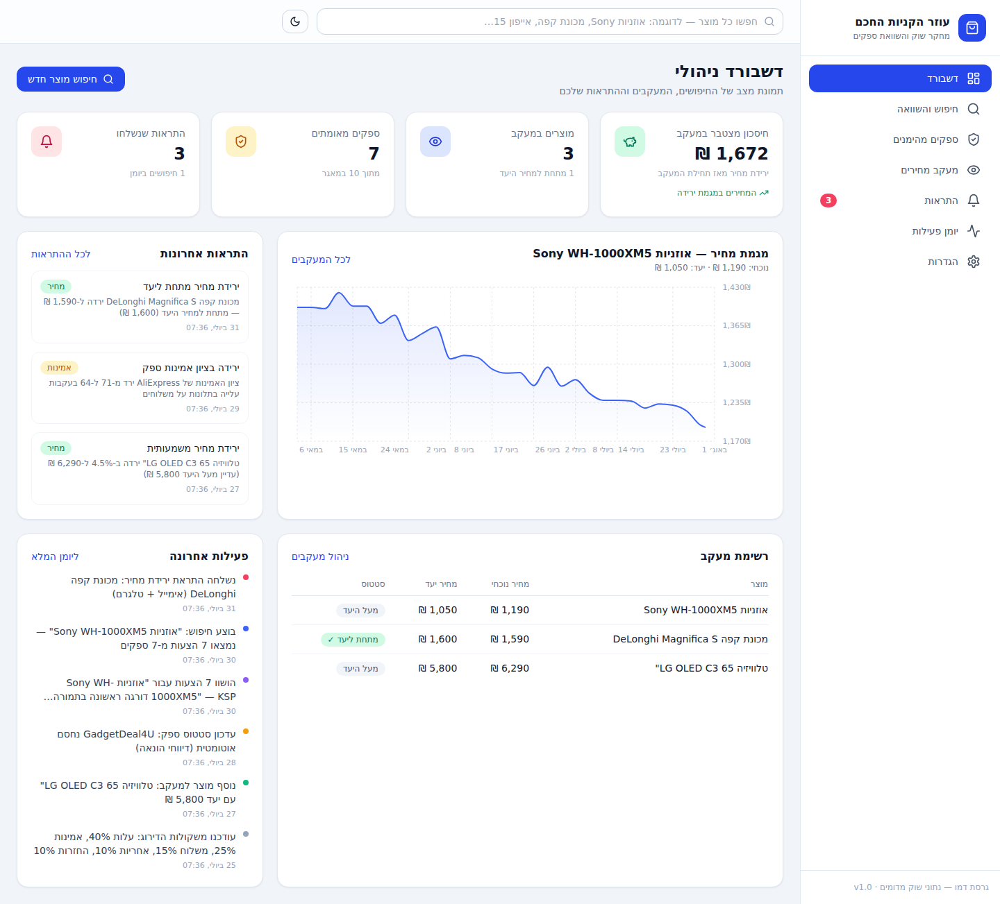 |
| **מצב כהה** | 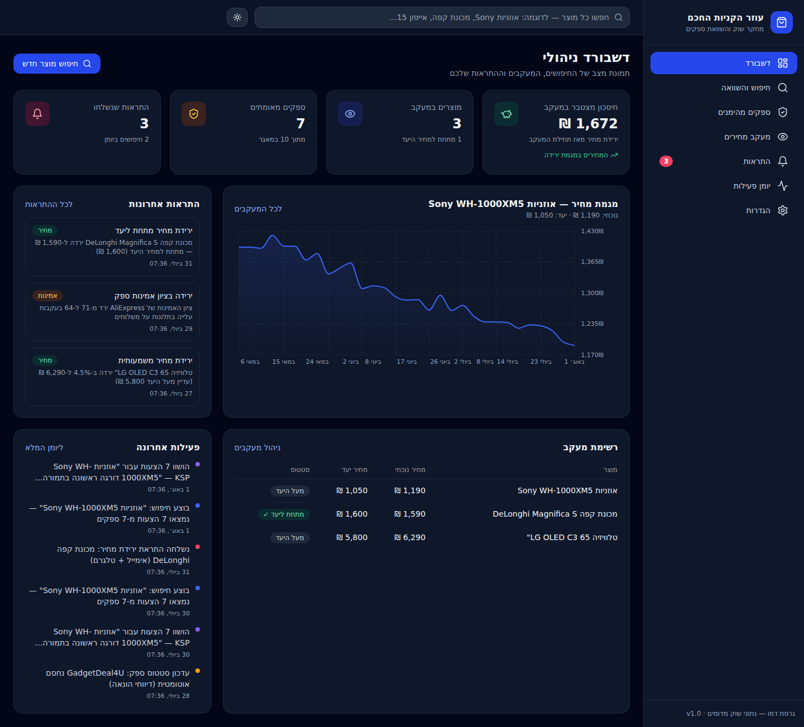 |
| **מובייל** | 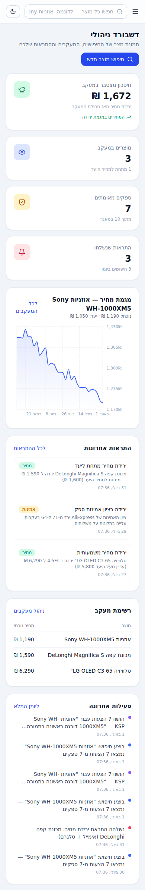 |

**מטרה:** לתת תמונת מצב בסקירה אחת — כמה חסכתי, מה במעקב, אילו ספקים אמינים,
מה קרה לאחרונה. זהו מסך הנחיתה ונקודת הפתיחה לכל פעולה.

**רכיבים:** `SectionHeader` · `KpiCard` ×4 · `PriceHistoryChart` · `Badge` · `Link` ×5

**Hooks:** `useMemo` (חישוב ה‑KPI) · `useAppStore` ×4 (watchlist, alerts, activity, suppliers)

**Functions:**
- `stats` (useMemo) — מחשב 4 מדדים:
  - `totalSaving` = Σ max(0, מחיר ראשון בהיסטוריה − מחיר נוכחי)
  - `belowTarget` = מספר פריטים שמחירם ≤ היעד
  - `verified` = ספקים מאומתים שאינם מוחרגים
  - `searches` = מספר רשומות מסוג `search` ביומן

**API Calls:** ❌ אין. כל הנתונים מה‑store.

**מבנה:** 4 כרטיסי KPI → גריד 2/3 + 1/3 (גרף מגמה + התראות אחרונות) → גריד 2/3 + 1/3
(טבלת מעקב + פעילות אחרונה).

---

### מסך 2 — חיפוש והשוואת מחירים

| | |
|---|---|
| **נתיב** | `/search` · `/search?q=...` |
| **קובץ** | `src/pages/SearchPage.tsx` (302 שורות) — **הקובץ המורכב ביותר** |
| **מצב ריק** | 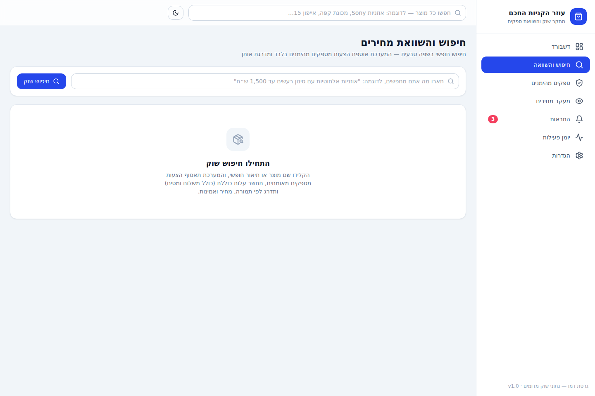 |
| **תוצאות** | 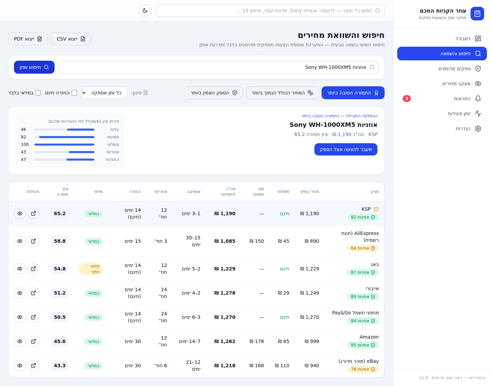 |
| **דירוג לפי מחיר** | 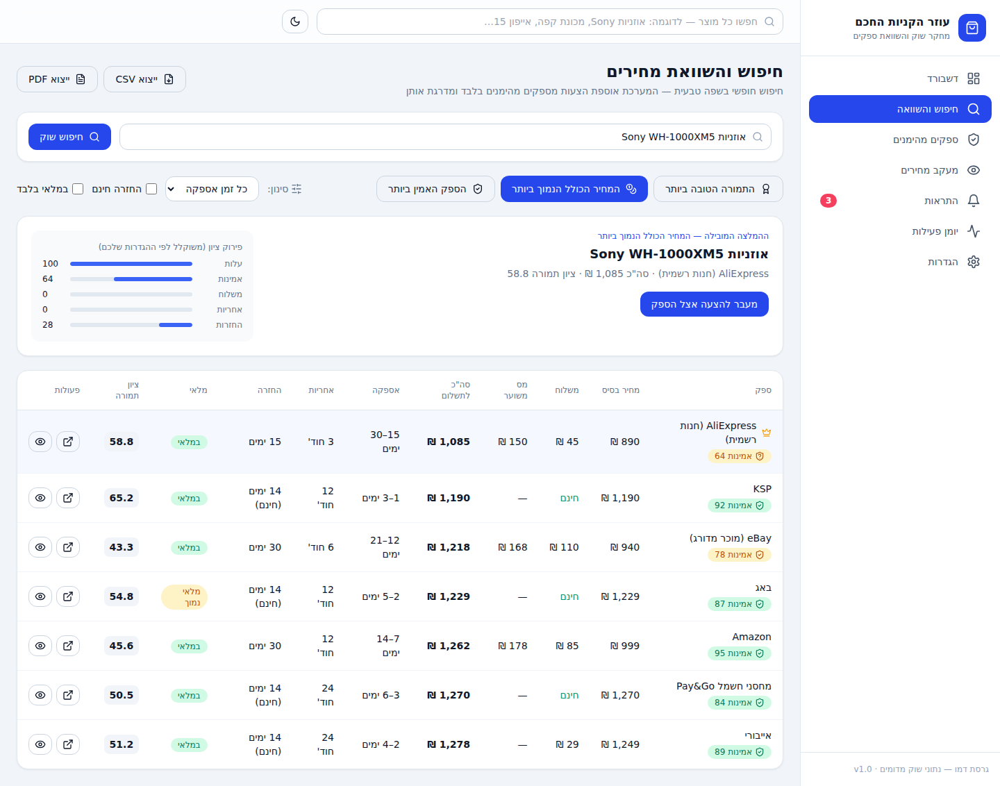 |
| **מצב כהה** | 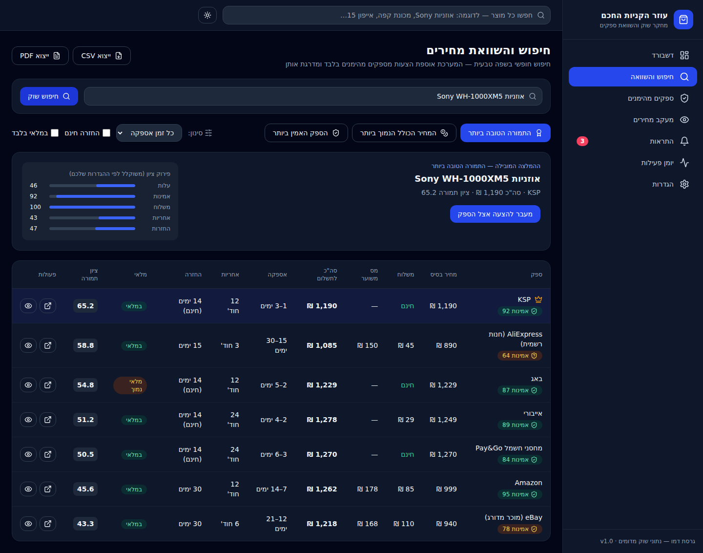 |

**מטרה:** לב המוצר. קליטת שאילתה חופשית → מחקר שוק → השוואה מדורגת → פעולה
(מעבר לספק או הוספה למעקב).

**רכיבים:** `SectionHeader` · `EmptyState` · `ComparisonTable` · `ScoreBar` ×5 · toast מותאם

**Hooks:** `useSearchParams` · `useState` ×8 · `useCallback` (`runSearch`) ·
`useEffect` ×3 · `useMemo` ×2 · `useAppStore` ×6

**Functions:**
| פונקציה | תפקיד |
|---|---|
| `runSearch(query)` | קורא ל‑provider, שומר תוצאות, מתעד ביומן |
| `submit(e)` | מעדכן `?q=` בכתובת (מפעיל את ה‑effect) |
| `trackOffer(offer)` | מוסיף למעקב עם יעד = 90% מהעלות הכוללת |
| `showToast(msg)` | הודעה צפה ל‑3.5 שניות |
| `onExportPdf()` | מציג את הודעת ה‑placeholder |
| `scored` (useMemo) | `scoreOffers(offers, suppliers, weights)` |
| `filtered` (useMemo) | סינון + `rankOffers` |

**API Calls:** `getSupplierDataProvider().searchOffers(query)` — **הקריאה היחידה
במערכת כולה**. זו הנקודה שתתחבר ל‑Backend.

**מצבים אפשריים:** ריק (לפני חיפוש) · טוען (spinner) · תוצאות · אין תוצאות (אחרי סינון)

---

### מסך 3 — ספקים מהימנים

| | |
|---|---|
| **נתיב** | `/suppliers` |
| **קובץ** | `src/pages/SuppliersPage.tsx` (163 שורות) |
| **צילום מסך** | 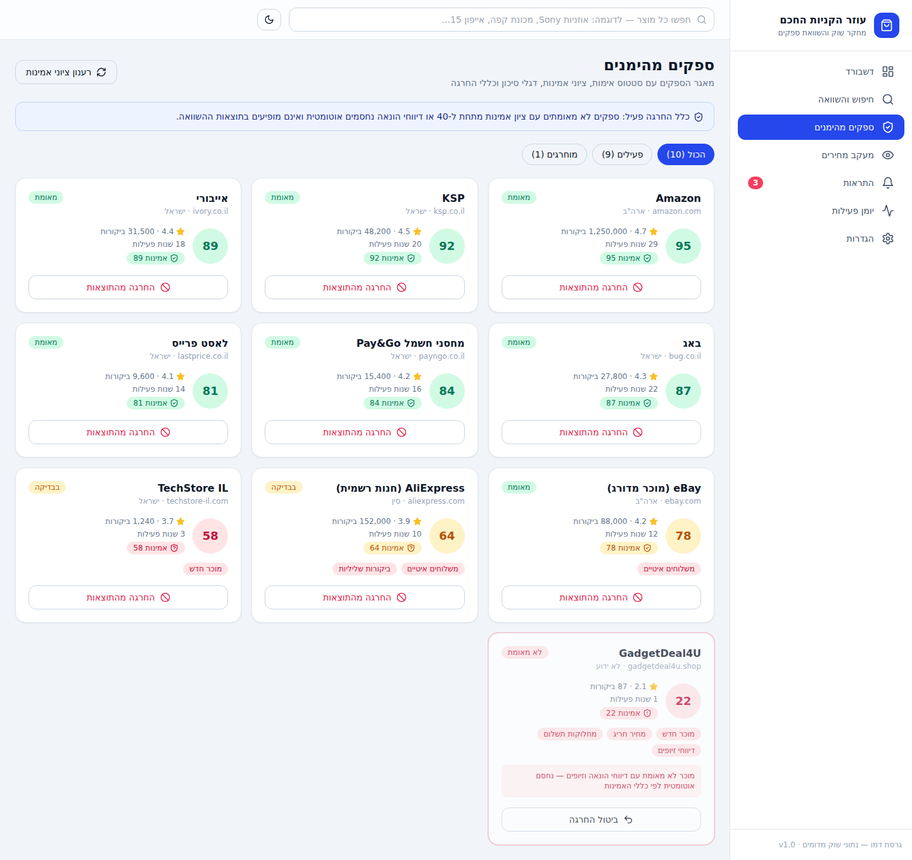 |
| **מצב כהה** | 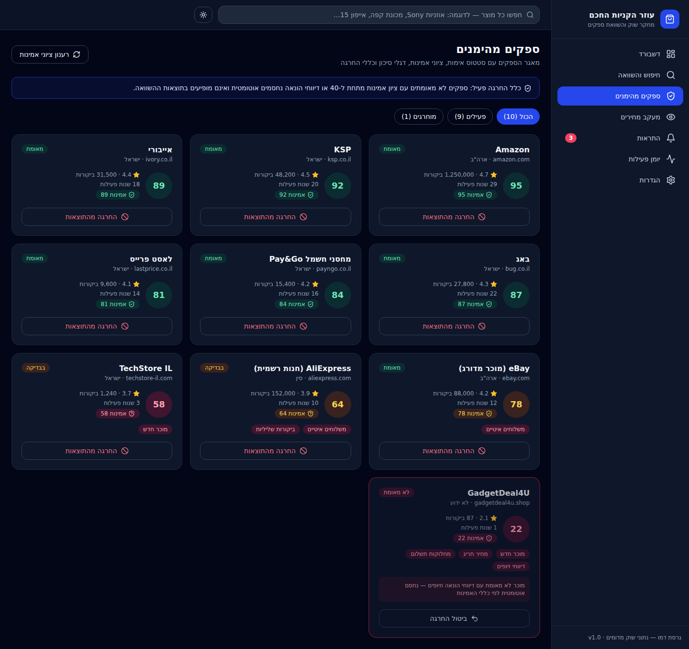 |

**מטרה:** שקיפות ושליטה על "ממי מותר לקנות". מציג את מאגר הספקים עם ציון אמינות,
סטטוס אימות ודגלי סיכון, ומאפשר החרגה ידנית.

**רכיבים:** `SectionHeader` · `Badge` · `TrustBadge` · `EmptyState`

**Hooks:** `useMemo` (מיון וסינון) · `useState` (מסנן תצוגה) · `useAppStore` ×3

**Functions:**
- `filtered` (useMemo) — מיון יורד לפי `trustScore`, סינון all/active/excluded
- `setSupplierExcluded(id, bool, reason)` — פעולת store
- `simulateTrustUpdate()` — הדמיית רענון ציונים

**API Calls:** ❌ אין (הספקים ב‑store).

**מיפוי צבעים:** ציון ≥80 ירוק · 60–79 ענבר · <60 אדום (`trustTone`).
6 סוגי דגלי סיכון · 3 סטטוסי אימות.

---

### מסך 4 — מעקב מחירים

| | |
|---|---|
| **נתיב** | `/watchlist` |
| **קובץ** | `src/pages/WatchlistPage.tsx` (132 שורות) |
| **צילום מסך** | 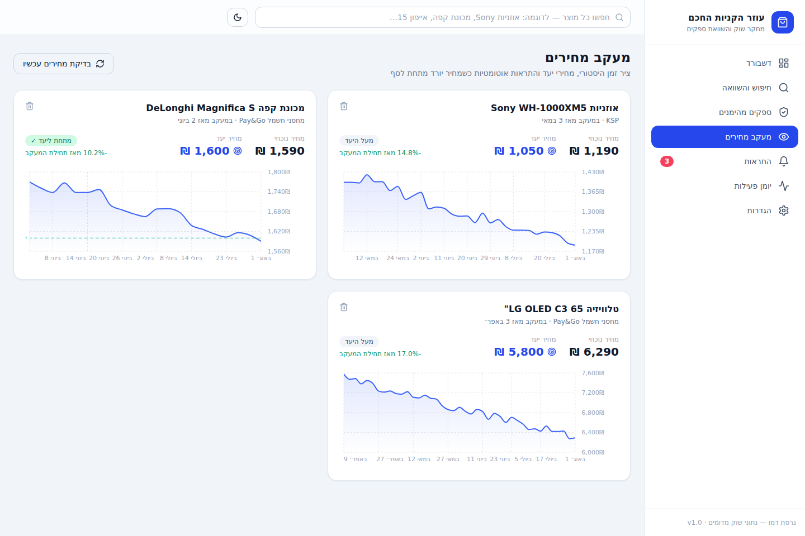 |
| **מצב כהה** | 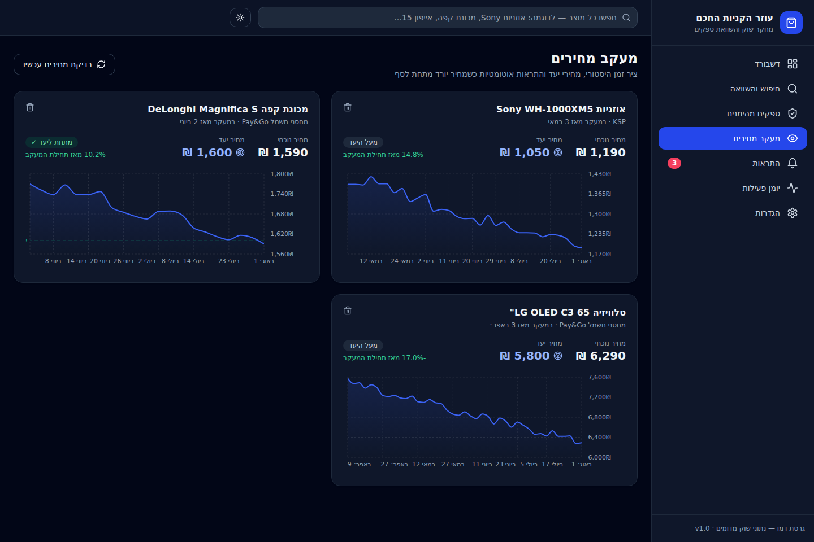 |
| **מובייל** | 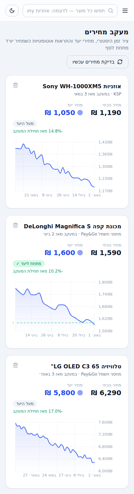 |

**מטרה:** ניהול המוצרים במעקב — היסטוריית מחיר, הגדרת יעד, וסימולציית בדיקה.

**רכיבים:** `SectionHeader` · `EmptyState` · `Badge` · `PriceHistoryChart`

**Hooks:** `useState` ×2 (עריכה inline) · `useAppStore` ×5

**Functions:**
- `saveTarget(id)` — ולידציה (מספר סופי > 0) ושמירה
- `changePct` — אחוז שינוי מתחילת המעקב
- `simulatePriceUpdates()` — סבב עדכון + הפעלת מנוע ההתראות

**API Calls:** ❌ אין. ⚠️ `fetchCurrentPrice` קיים ב‑provider אך **אינו בשימוש**.

---

### מסך 5 — מרכז התראות

| | |
|---|---|
| **נתיב** | `/alerts` |
| **קובץ** | `src/pages/AlertsPage.tsx` (139 שורות) |
| **צילום מסך** | 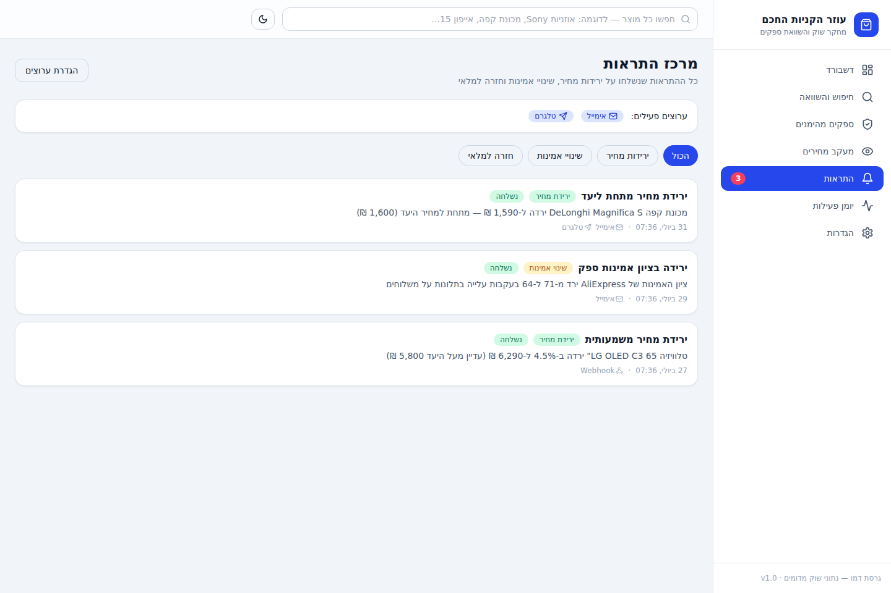 |

**מטרה:** לוג של כל ההתראות שנוצרו, עם סטטוס שליחה וערוצים.

**רכיבים:** `SectionHeader` · `EmptyState` · `Badge` ×3 לכל שורה

**Hooks:** `useMemo` (סינון) · `useState` (סוג נבחר) · `useAppStore` ×2

**Functions:** `filtered` (useMemo) · `activeChannels` (נגזר מההגדרות)

**API Calls:** ❌ אין. ⚠️ **אף התראה לא נשלחת בפועל** — הסטטוס `'sent'` הוא סימולציה.

**⚠️ באג ידוע:** קיים טאב סינון "חזרה למלאי" אך שום קוד לא מייצר התראות מסוג
`back_in_stock` — הטאב תמיד ריק.

---

### מסך 6 — יומן פעילות

| | |
|---|---|
| **נתיב** | `/activity` |
| **קובץ** | `src/pages/ActivityPage.tsx` (88 שורות) |
| **צילום מסך** | 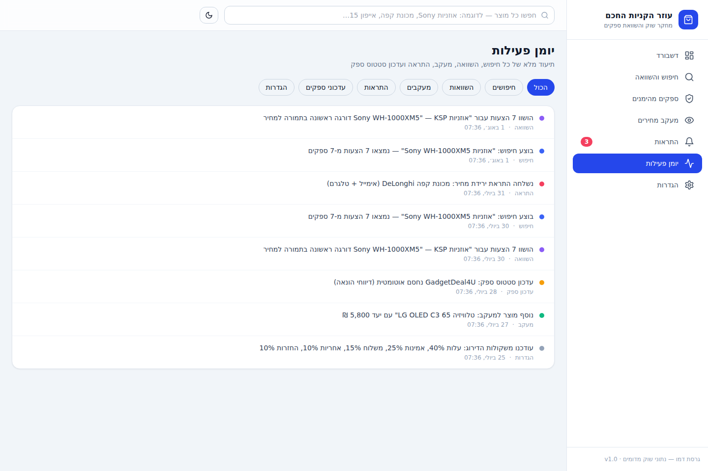 |

**מטרה:** תיעוד מלא של כל פעולה במערכת — מסלול ביקורת.

**רכיבים:** `SectionHeader` · `EmptyState` · טיימליין עם נקודות צבע

**Hooks:** `useMemo` (סינון) · `useState` · `useAppStore` ×1

**⚠️ הערה חשובה למפתח:** קובץ זה **מייצא** את הקבוע `ACTIVITY_META`
(מיפוי סוג → תווית + צבע), ו‑`DashboardPage` **מייבא אותו ממנו**.
זו תלות עמוד↔עמוד שמפרה את הפרדת השכבות. ראו סעיף 11.

**6 סוגי רשומות:** `search` כחול · `compare` סגול · `track` ירוק · `alert` אדום ·
`supplier_update` ענבר · `settings` אפור

---

### מסך 7 — הגדרות

| | |
|---|---|
| **נתיב** | `/settings` |
| **קובץ** | `src/pages/SettingsPage.tsx` (223 שורות) |
| **צילום מסך** | 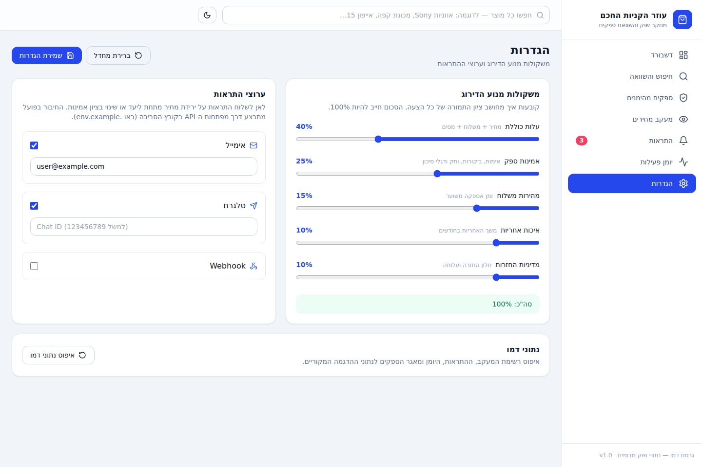 |
| **מצב כהה** | 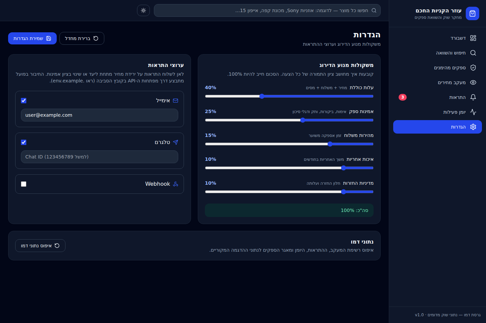 |

**מטרה:** כוונון מנוע הדירוג וערוצי ההתראות.

**רכיבים:** `SectionHeader` · 5 מחווני טווח · 3 בלוקי ערוץ · אזור איפוס

**Hooks:** `useState` ×3 (טיוטות) · `useEffect` ×2 (סנכרון עם store) · `useAppStore` ×5

**Functions:**
- `total` — סכום המשקולות; שמירה חסומה אם ≠ 100
- `save()` — שומר משקולות + ערוצים, מציג "נשמר ✓" ל‑2.5 שניות

**דפוס טיוטה:** השינויים נשמרים ב‑state מקומי ומוחלים רק בלחיצה על "שמירה" —
מאפשר ביטול ומונע חישוב מחדש בכל תזוזת מחוון.

**⚠️ באג ידוע:** כפתור "ברירת מחדל" מאפס **רק** את המשקולות, לא את הערוצים.

---

### רכיבי מסגרת (בכל המסכים)

| | |
|---|---|
| **Sidebar** | ניווט 7 פריטים + badge מספר התראות. במובייל: נשלף עם overlay |
| **Topbar** | חיפוש גלובלי + כפתור מצב כהה. דביק (`sticky`) |
| **תפריט מובייל** | 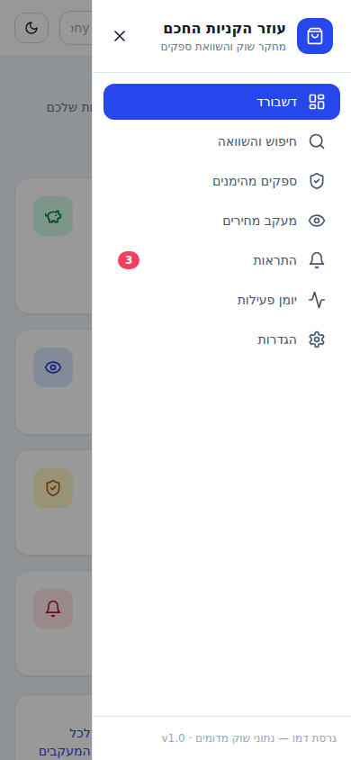 |

---

## 7. Components

### טבלה מלאה — 17 רכיבים

| # | Component | Purpose | Props | State | Dependencies |
|---|---|---|---|---|---|
| 1 | `App` | הגדרת נתיבים + החלת theme על `<html>` | — | — | react-router, useAppStore, 7 pages |
| 2 | `AppLayout` | שלד: Sidebar + Topbar + Outlet | — | `sidebarOpen: boolean` | Outlet, Sidebar, Topbar |
| 3 | `Sidebar` | ניווט ראשי + badge התראות | `open: boolean`<br>`onClose: () => void` | — | NavLink, lucide ×9, useAppStore |
| 4 | `Topbar` | חיפוש גלובלי + מצב כהה | `onOpenSidebar: () => void` | `query: string` | useNavigate, lucide ×4, useAppStore |
| 5 | `SectionHeader` | כותרת עמוד + אזור פעולות | `title: string`<br>`subtitle?: string`<br>`actions?: ReactNode` | — | — (טהור) |
| 6 | `KpiCard` | כרטיס מדד עם אייקון ומגמה | `title` `value` `subtitle?`<br>`icon: LucideIcon`<br>`trend?: {value, positive}`<br>`accent?: 4 גוונים` | — | lucide (TrendingUp/Down) |
| 7 | `Badge` | תג צבעוני | `tone?: 5 גוונים`<br>`children: ReactNode` | — | — (טהור) |
| 8 | `TrustBadge` | תג אמינות ספק | `supplier: Supplier` | — | Badge, lucide ×3 |
| 9 | `ScoreBar` | פס פירוק ציון | `label: string`<br>`value: number (0-100)` | — | — (טהור) |
| 10 | `EmptyState` | מצב ריק | `icon: LucideIcon`<br>`title` `description`<br>`action?: ReactNode` | — | — (טהור) |
| 11 | `PriceHistoryChart` | גרף מחיר + קו יעד | `history: PricePoint[]`<br>`targetPrice?: number`<br>`height?: number` | — | recharts ×8, format |
| 12 | `ComparisonTable` | טבלת השוואה (11 עמודות) | `offers: ScoredOffer[]`<br>`bestOfferId?: string`<br>`onTrack?: (o) => void` | — | Badge, TrustBadge, lucide ×3, format |
| 13 | `DashboardPage` | מסך דשבורד | — | — | KpiCard, PriceHistoryChart, Badge, ACTIVITY_META |
| 14 | `SearchPage` | מסך חיפוש והשוואה | — | 8 משתני state | ComparisonTable, ScoreBar, EmptyState, api, scoring, export |
| 15 | `SuppliersPage` | מסך ספקים | — | `view: ViewFilter` | Badge, TrustBadge, EmptyState |
| 16 | `WatchlistPage` | מסך מעקב | — | `editingId`, `editValue` | PriceHistoryChart, Badge, EmptyState |
| 17 | `AlertsPage` | מסך התראות | — | `typeFilter` | Badge, EmptyState |
| 18 | `ActivityPage` | מסך יומן + `ACTIVITY_META` | — | `filter` | EmptyState |
| 19 | `SettingsPage` | מסך הגדרות | — | `draftWeights`, `draftChannels`, `saved` | scoring (DEFAULT_WEIGHTS) |

### סיווג רכיבים

**רכיבים טהורים (props → JSX, ללא state וללא store):**
`SectionHeader` · `Badge` · `ScoreBar` · `EmptyState` · `KpiCard` · `TrustBadge` ·
`PriceHistoryChart` · `ComparisonTable`
→ **הכי קלים לבדיקה ולשימוש חוזר. אלה הראשונים לכתוב להם טסטים.**

**רכיבים מחוברים ל‑store:** `Sidebar` · `Topbar` · כל 7 העמודים

### מוסכמות רכיבים

1. `export default` לרכיב הראשי בקובץ; named export רק לעזרים (`trustTone`, `ACTIVITY_META`).
2. `interface Props` מוגדר מעל הרכיב, לא inline.
3. אין `React.FC` — חתימה רגילה: `export default function X({ a, b }: Props)`.
4. אייקונים מועברים כטיפוס `LucideIcon`, לא כ‑JSX.
5. וריאנטים כאובייקטי מיפוי (`const TONES: Record<Tone, string>`), לא כשרשור מחרוזות.

---

## 8. Services

> **הבהרה חשובה:** התבנית המקורית של המסמך מבקשת שירותי AI, OCR, Vision ועיבוד תמונה.
> **אף אחד מהם אינו קיים בפרויקט.** להלן פירוט מדויק של מה שכן קיים, ואחריו
> הצהרה מפורשת על מה שאינו קיים.

### 8.1 `services/api.ts` — שכבת הנתונים ⭐ הקובץ החשוב ביותר לאינטגרציה

```ts
export interface SupplierDataProvider {
  searchOffers(query: string): Promise<Offer[]>;
  listSuppliers(): Promise<Supplier[]>;
  fetchCurrentPrice(query: string, supplierId: string): Promise<number | null>;
}
```

**המימוש הקיים:** `MockSupplierDataProvider` — מוסיף השהיה של 600–1100ms כדי
שמצבי הטעינה יתנהגו כמו בייצור, ומחזיר נתונים מ‑`data/seed.ts`.

**נקודת ההחלפה:**
```ts
export function getSupplierDataProvider(): SupplierDataProvider {
  if (!provider) {
    provider = new MockSupplierDataProvider();
    // ← כאן ייכנס:
    // if (API_BASE_URL) provider = new HttpSupplierDataProvider(API_BASE_URL);
  }
  return provider;
}
```

**⚠️ שימו לב:** `listSuppliers()` ו‑`fetchCurrentPrice()` **מוגדרים אך אינם נקראים
משום מקום בקוד**. הספקים נטענים מה‑seed ישירות ל‑store באתחול.

### 8.2 `services/scoring.ts` — מנוע הדירוג ⭐ הלוגיקה העסקית המרכזית

```ts
export const DEFAULT_WEIGHTS: ScoreWeights = {
  totalCost: 40, trust: 25, delivery: 15, warranty: 10, returns: 10,
};
```

**פונקציות מיוצאות:**

| פונקציה | חתימה | תפקיד |
|---|---|---|
| `offerTotalCost` | `(Offer) => number` | `basePrice + shippingCost + taxEstimate` |
| `scoreOffers` | `(Offer[], Supplier[], ScoreWeights) => ScoredOffer[]` | סינון + נרמול + שקלול |
| `rankOffers` | `(ScoredOffer[], RankingMode) => ScoredOffer[]` | מיון לפי מצב |

**פונקציות פנימיות:** `lowerIsBetter` · `higherIsBetter` · `returnPolicyQuality`

**נוסחת ההחזרות:**
```
returnCost === 'none'  →  0
אחרת: min(returnDays/30, 1) × (returnCost === 'free' ? 1.0 : 0.55) × 100
```

**⚠️ נקודה עדינה שחייבים להבין:** ארבעה ממדים מנורמלים **יחסית לסט הנוכחי**
(הזול ביותר בחיפוש מקבל 100), אבל **האמינות היא ערך מוחלט** (`supplier.trustScore`).
המשמעות: ספק עם ציון 64 יקבל 64 בממד האמינות תמיד, גם אם הוא הכי אמין בתוצאות.
זו החלטה מכוונת — אמינות היא תכונה של הספק, לא של ההשוואה — אבל היא לא אינטואיטיבית.

### 8.3 `services/alerts.ts` — מנוע ההתראות

| פונקציה | תפקיד |
|---|---|
| `enabledChannels(settings)` | מחזיר את הערוצים הפעילים |
| `evaluatePriceChange(item, prev, next, channels)` | מחיל את כללי המחיר |
| `trustChangeAlert(name, prev, next, channels)` | יוצר התראת שינוי אמינות |

**כללי ההתראה:**
1. **חציית יעד** — `prev > target && next <= target` → התראה (עדיפות עליונה)
2. **ירידה משמעותית** — ירידה ≥ 5% → התראה (רק אם כלל 1 לא הופעל)
3. **שינוי אמינות** — כל שינוי בציון

**⚠️ המנוע מייצר רשומות בלבד.** הסטטוס `'sent'` נקבע לפי "האם יש ערוץ פעיל",
לא לפי שליחה אמיתית. **אין קוד ששולח אימייל, טלגרם או webhook.**

### 8.4 `services/export.ts` — ייצוא

| פונקציה | סטטוס |
|---|---|
| `exportComparisonCsv(offers, query)` | ✅ עובד — 12 עמודות, BOM לעברית באקסל |
| `exportComparisonPdf()` | ❌ placeholder — מחזיר `{ok: false, reason}` |

**⚠️ סיכון אבטחה:** הייצוא עוטף בגרשיים אך **לא מנטרל CSV Formula Injection**
(ערך שמתחיל ב‑`=`, `+`, `-`, `@`). ראו סעיף 14.

### 8.5 `services/format.ts` — עיצוב תצוגה

מבוסס כולו על `Intl` המובנה, ללא ספריות תאריכים:
`formatCurrency` (ILS, ללא עשרוניות) · `formatNumber` · `formatDate` · `formatDateTime` ·
`formatDeliveryRange` · `newId(prefix)`

### 8.6 שירותים שאינם קיימים — הצהרה מפורשת

| שירות מבוקש | סטטוס | מה יידרש כדי לבנות אותו |
|---|---|---|
| **AI / LLM** | ❌ **לא קיים** | פירוק שאילתה לפרמטרים מובְנים, סיכום ביקורות, זיהוי מוצר זהה בין ספקים. ראו סעיף 15. |
| **OCR** | ❌ **לא קיים** | שימוש אפשרי: צילום תווית מחיר בחנות → חיפוש אוטומטי. יידרש Tesseract או Vision API. |
| **Vision** | ❌ **לא קיים** | שימוש אפשרי: צילום מוצר → זיהוי דגם. יידרש מודל multimodal. |
| **Storage** | ❌ **לא קיים** | אין העלאת קבצים. הייצוא הוא Blob זמני בזיכרון הדפדפן. |
| **Search** (מנוע חיפוש) | ⚠️ **חלקי** | קיימת התאמת מילות מפתch (`String.includes`) על 5 ערכי קטלוג. אין Elasticsearch/Algolia/vector search. |
| **Image Processing** | ❌ **לא קיים** | אין תמונות מוצר בכלל במערכת. |

---

## 9. GitHub

### Repository

| | |
|---|---|
| **שם מלא** | `avi7756-design/mind-space` |
| **בעלים** | avi7756-design |
| **הערה חשובה** | ⚠️ זהו ריפו **משותף לשתי אפליקציות נפרדות** |

### שתי האפליקציות בריפו

| | mind-space (קיימת מקודם) | shopping-assistant (זו) |
|---|---|---|
| מיקום קוד | שורש הריפו (`index.html`) | `shopping-assistant/` |
| טכנולוגיה | HTML/JS יחיד + Service Worker | React + TypeScript + Vite |
| PWA | ✅ כן (`sw.js`, manifest) | ❌ לא |
| כתובת | `/mind-space/` | `/mind-space/shopping/` |

**⚠️ אזהרה למפתח הבא:** `sw.js` בשורש רושם Service Worker עם scope של כל הריפו.
הוא מוגדר network‑first ל‑HTML, ולכן אינו אמור לשבור את `/shopping/` — אך **אם
תיתקלו בגרסה ישנה שנתקעת במטמון, זו הסיבה הראשונה לבדוק.**

### Branches

| ענף | תוכן | תפקיד |
|---|---|---|
| `main` | mind-space + `shopping/` (תוצר בנייה) | ענף הפריסה |
| `claude/shopping-assistant-app-139m55` | `shopping-assistant/` (קוד מקור) | ענף הפיתוח |

### Workflow

**⚠️ אין קובץ workflow מותאם בריפו.** אין `.github/workflows/`.
מה שרץ הוא ה‑workflow המובנה של GitHub: `pages build and deployment`,
שמופעל אוטומטית בכל דחיפה ל‑`main`.

**ריצה אחרונה שאומתה:** commit `536e01b` — `completed / success`.

### Deploy — התהליך הידני הנוכחי

```bash
# 1. בענף הפיתוח: בנייה
cd shopping-assistant
npm run build                       # → dist/

# 2. העתקת התוצר החוצה (כדי לא לאבד אותו במעבר ענף)
cp -r dist /tmp/shopping-dist

# 3. מעבר ל-main והחלפת התוכן
git checkout main
git pull origin main
cp -r /tmp/shopping-dist/. shopping/

# 4. commit ו-push
git add shopping
git commit -m "עדכון פריסת עוזר הקניות"
git push -u origin main

# 5. חזרה לענף הפיתוח
git checkout claude/shopping-assistant-app-139m55
```

**⚠️ זהו תהליך ידני ושביר.** המלצה חזקה: ליצור GitHub Action שיבצע אותו אוטומטית.
טיוטה מלאה מופיעה ב‑`ROADMAP.md`.

### חלופות פריסה מוכנות (לא מחוברות)

| | קובץ | מה צריך להגדיר |
|---|---|---|
| **Netlify** | `netlify.toml` | Base directory = `shopping-assistant` |
| **Vercel** | `vercel.json` | Root Directory = `shopping-assistant` |

שניהם כוללים כבר SPA rewrite ל‑`index.html`.

### Secrets

**מצב נוכחי: אין ולו secret אחד מוגדר — לא ב‑GitHub ולא בסביבת הריצה.**

הקובץ `.env.example` מגדיר 5 placeholders:

| משתנה | ייעוד עתידי | ⚠️ הערת אבטחה |
|---|---|---|
| `VITE_API_BASE_URL` | כתובת ה‑Backend | ציבורי — מותר |
| `VITE_MARKET_DATA_API_KEY` | ספק נתוני מחירים | 🔴 **אסור** — ראו למטה |
| `VITE_TELEGRAM_BOT_TOKEN` | בוט טלגרם | 🔴 **אסור** |
| `VITE_EMAIL_SERVICE_API_KEY` | שירות אימייל | 🔴 **אסור** |
| `VITE_DEFAULT_WEBHOOK_URL` | webhook ברירת מחדל | ⚠️ תלוי ברגישות |

### 🔴 אזהרת האבטחה החשובה ביותר במסמך

> **כל משתנה שמתחיל ב‑`VITE_` נצרב לתוך ה‑JavaScript ונשלח לכל דפדפן.
> הוא גלוי לחלוטין לכל מי שפותח את קוד המקור של הדף.**
>
> המשמעות: **אין לשים מפתח API אמיתי, טוקן בוט או סוד כלשהו במשתנה `VITE_`.**
> הסודות הללו חייבים לחיות **בצד השרת בלבד**. הלקוח יקרא ל‑Backend שלכם,
> וה‑Backend הוא זה שיחזיק את הטוקנים.
>
> ה‑placeholders בקובץ קיימים כדי לתעד את הצורך העתידי — **לא כהזמנה למלא אותם.**

---

## 10. TODO

### 🔴 Critical — חובה לפני שימוש אמיתי

| # | משימה | פירוט | קבצים מושפעים |
|---|---|---|---|
| C1 | מימוש `HttpSupplierDataProvider` | לקוח HTTP אמיתי שמממש את הממשק | `services/api.ts` |
| C2 | הקמת Backend | API לחיפוש הצעות + מאגר ספקים | חדש |
| C3 | סקרייפר / ספק נתוני מחירים | המקור האמיתי לנתונים | חדש (שרת) |
| C4 | העברת סודות לצד שרת | טוקנים אסור שיהיו ב‑`VITE_` | תשתית |
| C5 | שליחת התראות בפועל | אימייל / טלגרם / webhook | חדש (שרת) |
| C6 | טיפול בשגיאות ב‑`runSearch` | כרגע `try/finally` ללא `catch` → כשל שקט | `pages/SearchPage.tsx:58` |
| C7 | Error Boundary גלובלי | שגיאת רינדור מפילה את כל האפליקציה | `App.tsx` |
| C8 | ולידציית URL של ספקים | URL מ‑API לא מהימן עלול להיות `javascript:` | `ComparisonTable.tsx` |
| C9 | מיגרציה ל‑persist | שינוי `seed.ts` לא מגיע למשתמשים קיימים | `store/useAppStore.ts` |

### 🟠 High — נדרש לאיכות מוצר

| # | משימה | פירוט |
|---|---|---|
| H1 | תשתית בדיקות (Vitest) | **אפס בדיקות כרגע** |
| H2 | בדיקות ל‑`scoring.ts` | הלוגיקה הקריטית ביותר, פונקציות טהורות |
| H3 | בדיקות ל‑`alerts.ts` | כללי סף — קלים לשבור |
| H4 | בדיקות e2e (Playwright) | מסלול חיפוש → השוואה → מעקב |
| H5 | ESLint + Prettier | אין כלי איכות קוד |
| H6 | ייצוא PDF אמיתי | מוצהר כ‑placeholder |
| H7 | Job מתוזמן לבדיקת מחירים | כרגע רק כפתור ידני |
| H8 | תיקון היסטוריה כפולה | `simulatePriceUpdates` מוסיף נקודה באותו תאריך |
| H9 | אחידות `currentPrice` | seed מול הוספה מהחיפוש — סמנטיקה שונה |
| H10 | GitHub Action לפריסה | התהליך הידני שביר |
| H11 | הסרת התלות `Dashboard → ActivityPage` | להעביר `ACTIVITY_META` ל‑`constants/` |
| H12 | מניעת כפילויות במעקב | אפשר להוסיף אותו מוצר פעמיים |

### 🟡 Medium

| # | משימה |
|---|---|
| M1 | היסטוריית ציוני אמינות (timeline) |
| M2 | התראות `back_in_stock` (הטאב קיים, המנגנון לא) |
| M3 | תמיכה במספר מטבעות |
| M4 | הגבלת גודל היסטוריה (localStorage יתמלא) |
| M5 | נגישות: `aria-label` למחוונים, `scope` לטבלה |
| M6 | ניווט מקלדת מלא + focus states |
| M7 | Code splitting לפי נתיב |
| M8 | הטמעת גופן מקומית (במקום Google Fonts) |
| M9 | הוספת PWA |
| M10 | תמיכה ב‑`safe-area-inset` לאייפון |
| M11 | הגדלת אזורי מגע ל‑44px |
| M12 | נטרול CSV Formula Injection |
| M13 | כתיבת `setTargetPrice` ו‑`resetDemoData` ליומן |
| M14 | תיקון "ברירת מחדל" שיאפס גם ערוצים |
| M15 | אפשרות לחפש שוב את אותה שאילתה |

### 🟢 Low

| # | משימה |
|---|---|
| L1 | i18n |
| L2 | תמונות מוצר |
| L3 | שיתוף השוואה בקישור |
| L4 | ייצוא JSON |
| L5 | קיצורי מקלדת |
| L6 | אנימציות מעבר |
| L7 | הדפסה מותאמת |
| L8 | Storybook |

---

## 11. Known Bugs

> כל הבאגים ברשימה **אומתו מול הקוד**. לכל אחד מצוין הקובץ המדויק.

| # | חומרה | באג | קובץ | תיאור מלא |
|---|---|---|---|---|
| B1 | 🔴 | **אין `catch` בחיפוש** | `SearchPage.tsx` | `runSearch` עוטף ב‑`try/finally` בלבד. ה‑mock לא נכשל אף פעם, אבל ברגע שיהיה API אמיתי — כשל רשת ישאיר את המשתמש עם מסך ריק ללא הסבר. |
| B2 | 🔴 | **אין מיגרציה ל‑persist** | `useAppStore.ts` | `version: 1` ללא `migrate`. משתמש עם state שמור לא יקבל שינויים ב‑`seed.ts` — ספקים חדשים לא יופיעו לו לעולם. |
| B3 | 🟠 | **נקודות היסטוריה כפולות** | `useAppStore.ts` | כל `simulatePriceUpdates` מוסיף נקודה עם `date` של היום. שתי לחיצות באותו יום = שתי נקודות באותו X. |
| B4 | 🟠 | **סמנטיקה לא עקבית של `currentPrice`** | `seed.ts` מול `SearchPage.tsx` | ב‑seed הערך הוא מחיר בסיס; ב‑`trackOffer` הוא `offer.totalCost`. שני מוצרים ברשימה מודדים דברים שונים. |
| B5 | 🟠 | **אי אפשר לחפש שוב אותה שאילתה** | `SearchPage.tsx` | ה‑effect משווה `urlQuery !== searched`. חיפוש חוזר של אותו טקסט לא עושה כלום. |
| B6 | 🟡 | **תלות עמוד↔עמוד** | `DashboardPage` → `ActivityPage` | `ACTIVITY_META` מיוצא מעמוד ומיובא לעמוד אחר. מפר הפרדת שכבות. |
| B7 | 🟡 | **`recordComparison` מדלג** | `SearchPage.tsx` | תלוי ב‑`[searched, offers.length]` עם `eslint-disable`. חיפוש חדש עם אותו מספר תוצאות ואותה שאילתה לא יתועד. |
| B8 | 🟡 | **טאב "חזרה למלאי" תמיד ריק** | `AlertsPage.tsx` | הסוג `back_in_stock` מוגדר ויש לו טאב, אבל שום קוד לא מייצר התראה כזו. |
| B9 | 🟡 | **`out_of_stock` לא בשימוש** | `types` / `seed.ts` | הטיפוס והתווית קיימים, אין נתון שמפעיל אותם. |
| B10 | 🟡 | **"ברירת מחדל" חלקי** | `SettingsPage.tsx` | מאפס משקולות בלבד, לא ערוצים — בניגוד לציפייה. |
| B11 | 🟡 | **כפילויות במעקב** | `useAppStore.ts` | `addToWatchlist` לא בודק אם המוצר כבר קיים. |
| B12 | 🟡 | **הזזת תאריך באזורי זמן שליליים** | `format.ts` | `new Date("2026-05-05")` מתפרש כ‑UTC. בישראל (UTC+2/+3) תקין; במערב אירופה/ארה״ב יוצג היום הקודם. |
| B13 | 🟢 | **שתי פעולות לא מתועדות** | `useAppStore.ts` | `setTargetPrice` ו‑`resetDemoData` לא כותבות ליומן. |
| B14 | 🟢 | **ציון מנופח בהצעה בודדת** | `scoring.ts` | כשיש הצעה אחת, `min === max` וכל הממדים מקבלים 100 → ציון ~93 מטעה. |
| B15 | 🟢 | **`fetchCurrentPrice` לא בשימוש** | `api.ts` | מוגדר בממשק, אף אחד לא קורא לו. |
| B16 | 🟢 | **`listSuppliers` לא בשימוש** | `api.ts` | הספקים נטענים ישירות מ‑seed. |
| B17 | 🟢 | **`localStorage` יגדל ללא גבול** | `useAppStore.ts` | היסטוריות מחיר צומחות; היומן חתוך ל‑200 אך ההיסטוריה לא. |

---

## 12. Performance

### מדדי הבנייה בפועל

```
dist/index.html                    0.95 kB │ gzip:   0.54 kB
dist/assets/index-C3vDXAv8.css    27.16 kB │ gzip:   5.13 kB
dist/assets/index-*.js            86.70 kB │ gzip:  24.20 kB   ← קוד האפליקציה
dist/assets/react-BB-_XRaL.js    165.05 kB │ gzip:  53.89 kB   ← React
dist/assets/charts-CQFy2kEA.js   383.12 kB │ gzip: 105.64 kB   ← Recharts ⚠️
─────────────────────────────────────────────────────────────
סה"כ                            ~663 kB   │ gzip: ~189 kB
```

### מה מאט את האתר — לפי סדר חשיבות

| # | הבעיה | ההשפעה | הפתרון |
|---|---|---|---|
| 1 | **Recharts = 383KB (58% מה‑bundle)** | הרכיב הכבד ביותר. נטען גם למי שלא רואה גרף. | `React.lazy` לגרף, או מעבר ל‑`lightweight-charts` / SVG ידני. חיסכון: ~105KB gzip |
| 2 | **Google Fonts חוסם רינדור** | 2 preconnect + stylesheet חיצוני. תלות ברשת חיצונית + FOUT. | הטמעת Heebo מקומית כ‑`woff2` + `font-display: swap` |
| 3 | **אין code splitting לפי נתיב** | כל 7 העמודים ב‑chunk אחד. | `React.lazy` + `Suspense` לכל נתיב. חיסכון: ~60% מהטעינה הראשונית |
| 4 | **`ResponsiveContainer` ברינדור מחדש** | Recharts מודד DOM בכל שינוי גודל. במסך מעקב יש N גרפים. | `debounce` או גובה קבוע במובייל |
| 5 | **`localStorage` סינכרוני באתחול** | חוסם את ה‑thread הראשי. זניח כרגע, יחמיר עם הצטברות נתונים. | הגבלת גודל + דחיסה |
| 6 | **חישוב ציונים מחדש** | `useMemo` תלוי ב‑`offers/suppliers/weights`. כל שינוי בספק כלשהו מחשב הכול מחדש. | זניח בעשרות הצעות; יידרש טיפול באלפים |
| 7 | **`hashString` + `mulberry32` בכל חיפוש** | מהיר מאוד — לא בעיה בפועל | — |

### מה כן טוב

* ✅ `manualChunks` מפריד react/charts — caching טוב יותר בין גרסאות
* ✅ אין תמונות בכלל — אפס עלות מדיה
* ✅ אייקוני lucide tree‑shakeable
* ✅ Tailwind purge — 27KB CSS בלבד לכל האפליקציה
* ✅ אין `console.log` בקוד הייצור
* ✅ `sourcemap: false` בבנייה

### מדידות שטרם בוצעו

❌ Lighthouse · ❌ Core Web Vitals (LCP/FID/CLS) · ❌ בדיקה ברשת איטית (3G) ·
❌ Bundle analyzer

---

## 13. Mobile

**נבדק:** iPhone 14 Pro (390×844) בסימולציית Chromium.
**לא נבדק:** מכשיר פיזי, Safari אמיתי, אנדרואיד אמיתי.

### מה עובד במובייל

| ✅ | פריט |
|---|---|
| ✅ | תפריט צד נשלף עם overlay כהה — נבדק ואומת |
| ✅ | כרטיסי KPI נערמים בטור אחד |
| ✅ | אין גלילה אופקית של הדף (תוקן במפורש עם `min-w-0`) |
| ✅ | הטבלה גוללת אופקית **בתוך המכל שלה בלבד** |
| ✅ | הגרפים מתכווצים דרך `ResponsiveContainer` |
| ✅ | RTL תקין |
| ✅ | מצב כהה תקין |

### מה לא עובד / בעייתי — אייפון (iOS Safari)

| # | חומרה | הבעיה | הסבר |
|---|---|---|---|
| i1 | 🟠 | **אין `safe-area-inset`** | ב‑iPhone עם notch, תוכן עלול להיחתך. נדרש `env(safe-area-inset-*)` |
| i2 | 🟠 | **אזורי מגע קטנים מדי** | אייקון המחיקה במעקב וכפתורי הטבלה ≈32px. תקן Apple: **44×44px** |
| i3 | 🟠 | **`min-h-screen` וסרגל הכתובת** | ב‑Safari `100vh` כולל את הסרגל הנעלם → קפיצה בגלילה. נדרש `100dvh` |
| i4 | 🟡 | **אין PWA** | לא ניתן להוסיף למסך הבית כאפליקציה |
| i5 | 🟡 | **זום בפוקוס על input** | Safari מזגזג אם `font-size < 16px`. השדות ב‑`text-sm` (14px) |
| i6 | 🟡 | **אין `-webkit-overflow-scrolling`** | גלילת הטבלה פחות חלקה |
| i7 | 🟡 | **`type="number"` ב‑RTL** | מקלדת מספרים + כיווניות — מועד לתקלות |
| i8 | 🟢 | **אין pull‑to‑refresh** | ציפייה טבעית באפליקציית מובייל |

### מה לא עובד / בעייתי — אנדרואיד (Chrome)

| # | חומרה | הבעיה |
|---|---|---|
| a1 | 🟠 | **אזורי מגע** — Material מחייב 48dp, כמה כפתורים קטנים מזה |
| a2 | 🟡 | **אין `theme-color`** — סרגל המערכת לא מתאים את צבעו למצב כהה |
| a3 | 🟡 | **אין PWA** — אין באנר התקנה |
| a4 | 🟡 | **`accent-color`** — נתמך ב‑Chrome מודרני; במכשירים ישנים ייראה גנרי |
| a5 | 🟢 | **כפתור "חזור" של המערכת** — עם `HashRouter` מתנהג נכון, אך לא נבדק פיזית |

### הבעיה החוצה־פלטפורמות: טבלת ההשוואה

הטבלה מוגדרת `min-w-[860px]` — במסך 390px המשתמש רואה כ‑45% ממנה וחייב לגלול
לצדדים כדי להשוות. **זו הפגיעה המשמעותית ביותר בחוויית המובייל.**

**פתרון מומלץ:** בתצוגת מובייל להחליף את הטבלה בכרטיסי השוואה — כרטיס לכל הצעה,
עם 4 השדות הקריטיים (ספק, סה״כ, אמינות, ציון) ופרטים נוספים ב‑accordion.

---

## 14. Security

> **הקשר:** אין Backend, אין אימות, ואין נתונים אמיתיים של משתמשים. חלק מהסיכונים
> תיאורטיים **היום** אך יהפכו למיידיים ברגע שיתווסף שרת. הרשימה ממוינת לפי הדחיפות
> **לקראת** האינטגרציה.

### 🔴 קריטי

| # | הממצא | הסבר | הפתרון |
|---|---|---|---|
| S1 | **`VITE_*` הם ציבוריים לחלוטין** | כל משתנה `VITE_` נצרב ל‑JS ונשלח לדפדפן. טוקן טלגרם או מפתח אימייל שם = **דלף מיידי לכל העולם**. | סודות בצד שרת בלבד. הלקוח מדבר עם ה‑Backend שלכם, ה‑Backend מחזיק את הטוקנים. |
| S2 | **אין אימות כלל** | כל מי שיש לו את הקישור רואה הכול. היום זה דמו — מחר אלה נתוני קניות אישיים. | הוספת auth לפני נתונים אמיתיים |
| S3 | **URL של ספק מרונדר כ‑`href` ללא ולידציה** | היום ה‑URLs קבועים בקוד. כשיגיעו מ‑API/סקרייפר, `javascript:alert(1)` ב‑`href` = XSS. | ולידציה: לאפשר `https:` בלבד |

### 🟠 גבוה

| # | הממצא | הסבר | הפתרון |
|---|---|---|---|
| S4 | **CSV Formula Injection** | `exportComparisonCsv` עוטף בגרשיים אך לא מנטרל ערך שמתחיל ב‑`=`/`+`/`-`/`@`. שם מוצר כזה יבוצע כנוסחה באקסל. | להוסיף `'` לפני תא שמתחיל בתו כזה |
| S5 | **אין CSP** | לא ב‑`netlify.toml`, לא ב‑`vercel.json`, לא ב‑Pages. | `Content-Security-Policy` + `X-Frame-Options` + `Referrer-Policy` |
| S6 | **פרטים אישיים ב‑localStorage בטקסט גלוי** | אימייל ו‑Chat ID של טלגרם נשמרים ללא הצפנה — נגישים לכל סקריפט בדף. | העברה לצד שרת עם האימות |

### 🟡 בינוני

| # | הממצא | הפתרון |
|---|---|---|
| S7 | **אין הגבלת קצב** | rate limiting ב‑Backend + debounce בלקוח |
| S8 | **אין ולידציית קלט** | סכמת Zod על כל תגובת API |
| S9 | **אין `Subresource Integrity` על Google Fonts** | הטמעה מקומית פותרת גם את זה |
| S10 | **`dangerouslySetInnerHTML`** | ✅ **לא בשימוש בכלל** — טוב, לשמור כך |
| S11 | **תלויות ללא סריקה** | `npm audit` ב‑CI + Dependabot |

### ✅ מה כבר נכון

* ✅ **אפס `dangerouslySetInnerHTML`** — כל הטקסט עובר escaping של React
* ✅ **`rel="noopener noreferrer"`** על כל `target="_blank"` — מונע tab‑nabbing
* ✅ **אין `eval` / `new Function`**
* ✅ **`.env` ב‑`.gitignore`** — רק `.env.example` ב‑git
* ✅ **אין סודות בהיסטוריית ה‑git** (נבדק)
* ✅ **TypeScript strict** — מונע מחלקה שלמה של באגי טיפוסים

---

## 15. AI Roadmap

> **מצב נוכחי: אפס רכיבי AI במערכת.** "חיפוש בשפה טבעית" מיושם כ‑`String.includes`
> על 5 ערכי קטלוג. כל מה שלהלן הוא **תוכנית**, לא תיאור.

### שלב 1 — הבנת שאילתה (הערך הגבוה ביותר, המאמץ הנמוך ביותר)

**הבעיה:** המשתמש כותב "אוזניות אלחוטיות עם סינון רעשים עד 1,500 ש״ח" והמערכת
מחפשת התאמת מחרוזת. כל המידע המובנה בשאילתה — התקציב, התכונה, הקטגוריה — הולך לאיבוד.

**הפתרון:** קריאת LLM אחת שממירה טקסט חופשי ל‑JSON מובנה:

```ts
interface ParsedQuery {
  category: string;
  brand?: string;
  model?: string;
  maxBudget?: number;
  requiredFeatures: string[];
  niceToHave: string[];
  urgency?: 'immediate' | 'flexible';
}
```

התקציב הופך למסנן, התכונות הופכות לניקוד — ללא שינוי ב‑UI.

### שלב 2 — התאמת מוצרים בין ספקים (הבעיה הקשה באמת)

**הבעיה:** ספק א׳ כותב `Sony WH-1000XM5 Black`, ספק ב׳ כותב `אוזניות סוני XM5 שחור`,
ספק ג׳ `WH1000XM5/B`. **בלי לזהות שאלה אותו מוצר, אין השוואת מחירים אמיתית.**

**הפתרון:** embeddings + דמיון קוסינוס, עם סף ואימות LLM למקרי גבול.
זו **הדרישה הקריטית ביותר** למעבר מדמו למוצר.

### שלב 3 — סיכום ביקורות

תמצות מאות ביקורות ל‑3 יתרונות + 3 חסרונות + "למי זה מתאים". ערך גבוה, קל יחסית.

### שלב 4 — הסבר ההמלצה בשפה טבעית

> "KSP מומלצת: היא לא הזולה (Amazon זולה ב‑72 ₪ במחיר הבסיס), אבל אחרי משלוח ומס
> היא יוצאת זולה ב‑63 ₪, מגיעה תוך 3 ימים במקום 14, ויש לה החזרה חינם."

### שלב 5 — זיהוי אנומליות מחיר

זיהוי מחיר נמוך חשוד (מוצר מזויף/משומש) ומחיר מנופח לפני "מבצע".

### שלב 6 — חיזוי מחיר

"על בסיס 90 יום, המחיר צפוי לרדת ל‑1,050 ₪ בעוד כשבועיים — שווה להמתין."

### שלב 7 — OCR ו‑Vision

צילום תווית מחיר בחנות → חיפוש אוטומטי. צילום מוצר → זיהוי דגם.

### שלב 8 — ניקוד אמינות אוטומטי

היום `trustScore` הוא מספר קבוע ב‑seed. בעתיד: מודל שמחשב אותו מביקורות,
תלונות, ותק ואיתותי דומיין.

### שיקולי יישום

| שיקול | המלצה |
|---|---|
| **איפה ה‑AI רץ** | **בשרת בלבד.** מפתח API בלקוח = דלף (ראו S1). |
| **עלות** | שלב 2 יקר (embedding לכל מוצר). לשמור במטמון. |
| **Latency** | פירוק שאילתה מוסיף ~1 שנייה. להריץ במקביל לחיפוש. |
| **Fallback** | **כל יכולת AI חייבת נתיב חלופי.** אם ה‑LLM נכשל — המערכת חוזרת להתנהגות הנוכחית. |
| **שקיפות** | לסמן תוכן שנוצר ב‑AI. לא להציג חיזוי כעובדה. |

---

## 16. Design System

### Colors

**צבע מותג — סקאלת `brand` (כחול):** מוגדרת ב‑`tailwind.config.js`

| גוון | HEX | שימוש |
|---|---|---|
| `brand-50` | `#eef4ff` | רקע באנרים |
| `brand-100` | `#dbe6fe` | רקע תגיות |
| `brand-500` | `#3b63f6` | גרפים, פסי ציון |
| `brand-600` | `#2547eb` | **כפתור ראשי, פריט ניווט פעיל** |
| `brand-700` | `#1d36d8` | hover |
| `brand-900` | `#1e2c8a` | טקסט כהה |

**צבעים סמנטיים (מ‑Tailwind):**

| משמעות | צבע | דוגמאות |
|---|---|---|
| הצלחה / אמינות גבוהה (≥80) | `emerald` | "במלאי", "מתחת ליעד", משלוח חינם |
| אזהרה / אמינות בינונית (60–79) | `amber` | "מלאי נמוך", "בבדיקה", כתר המנצח |
| סיכון / אמינות נמוכה (<60) | `rose` | דגלי סיכון, "לא מאומת", badge התראות |
| ניטרלי | `slate` | טקסט, גבולות, רקעים |

**ניטרליים:** `slate` (אפור עם נטייה כחלחלה — משתלב עם ה‑brand הכחול)

| שכבה | בהיר | כהה |
|---|---|---|
| רקע דף | `slate-100` | `slate-950` |
| רקע כרטיס | `white` | `slate-900` |
| גבול | `slate-200` | `slate-800` |
| טקסט ראשי | `slate-900` | `slate-100` |
| טקסט משני | `slate-500` | `slate-400` |

### Typography

| | |
|---|---|
| **גופן** | **Heebo** — משקלים 300/400/500/600/700/800 |
| **מקור** | Google Fonts (⚠️ תלות חיצונית — ראו סעיף 12) |
| **Fallback** | `system-ui`, `sans-serif` |
| **למה Heebo** | תמיכה מלאה בעברית + לטינית, מותאם למסך, קריא במשקלים נמוכים |

| רמה | מחלקות | שימוש |
|---|---|---|
| כותרת עמוד | `text-xl lg:text-2xl font-bold` | `SectionHeader` |
| כותרת סעיף | `text-lg font-bold` | כותרות בכרטיסים |
| כותרת כרטיס | `font-semibold` | כותרות משנה |
| ערך KPI | `text-2xl font-bold` | מספרים גדולים |
| טקסט רגיל | `text-sm` (14px) | ברירת מחדל |
| טקסט משני | `text-xs` (12px) | תיאורים |
| חותמת זמן | `text-[11px]` | תאריכים ביומן |

### Spacing

**סקאלת Tailwind (יחידות 4px).**

| הקשר | ערך |
|---|---|
| ריווח בין קטעים | `space-y-5` (20px) |
| ריווח בין כרטיסים | `gap-4` / `gap-5` |
| ריפוד כרטיס | `p-5` (20px) |
| ריפוד תא בטבלה | `px-4 py-3` |
| ריפוד עמוד | `p-4 lg:p-6` |
| רוחב סרגל צד | `w-72` (288px) |

**נקודות שבירה:** `sm` 640px · `lg` 1024px (סרגל הצד הופך קבוע) · `xl` 1280px (גריד 3 עמודות)

### Buttons

שלושה סגנונות מוגדרים ב‑`index.css` תחת `@layer components`:

```css
.btn-primary  /* רקע brand-600, טקסט לבן, rounded-xl, hover:brand-700 */
.btn-ghost    /* גבול slate-300, שקוף, hover:slate-100 */
.input        /* גבול, rounded-xl, focus: גבול brand-500 + ring 20% */
.card         /* רקע לבן, גבול slate-200, rounded-2xl, shadow-card */
```

**עיגול פינות:** כפתורים/שדות `rounded-xl` (12px) · כרטיסים `rounded-2xl` (16px) ·
תגיות `rounded-full`

**צל:** `shadow-card` מותאם — עדין מאוד (6% שקיפות), לא `shadow-lg` גנרי.

### Icons

| | |
|---|---|
| **ספרייה** | `lucide-react` |
| **גודל סטנדרטי** | `h-4 w-4` (16px) בכפתורים · `h-5 w-5` (20px) בניווט |
| **כמות בשימוש** | ~35 אייקונים |

**מיפוי סמנטי קבוע:**
`ShoppingBag` מותג · `LayoutDashboard` דשבורד · `Search` חיפוש · `ShieldCheck` ספקים ·
`Eye` מעקב · `Bell` התראות · `Activity` יומן · `Settings` הגדרות · `Crown` המנצח ·
`Award` תמורה · `Coins` מחיר · `Target` יעד · `Moon`/`Sun` מצב תצוגה

### Animations

**מינימליסטי בכוונה — כמעט אין אנימציות.**

| מה | איך |
|---|---|
| מעברי צבע | `transition` (ברירת מחדל 150ms) |
| החלקת סרגל צד | `transition-transform` |
| spinner טעינה | `animate-spin` |
| toast | הופעה מיידית, נעלם אחרי 3.5s |

**מה אין:** אנימציות מעבר בין עמודים · אנימציות כניסה · parallax · אנימציית מספרים

**⚠️ חוסר:** אין `prefers-reduced-motion` (אך כמעט אין תנועה, כך שההשפעה מזערית).

---

## 17. UX Review

### 🔴 בעיות משמעותיות

| # | הבעיה | למה זה כואב | הצעת פתרון |
|---|---|---|---|
| U1 | **טבלה של 860px במסך 390px** | המשתמש רואה 45% מהטבלה. השוואה במובייל היא בעצם בלתי אפשרית. | תצוגת כרטיסים במובייל |
| U2 | **שמירת הגדרות חסומה ללא הסבר בולט** | הכפתור מעומעם כשהסכום ≠ 100%. ההסבר נמצא רחוק ממנו. | הודעה צמודה לכפתור + נרמול אוטומטי |
| U3 | **איזון משקולות ידני מתסכל** | כדי להעלות "עלות" צריך להוריד ידנית ממקום אחר עד שמגיעים ל‑100. | חלוקה מחדש אוטומטית של השאר |
| U4 | **אין ביטול למחיקה** | הסרה מהמעקב מיידית, ללא אישור וללא Undo. | toast עם "ביטול" ל‑5 שניות |

### 🟠 בעיות בינוניות

| # | הבעיה | הצעת פתרון |
|---|---|---|
| U5 | **שני שדות חיפוש** — בסרגל העליון ובעמוד | להסתיר את העליון בעמוד החיפוש |
| U6 | **מחיר יעד ברירת מחדל 90%** — שרירותי וללא הסבר | דיאלוג קצר עם הצעות: 5% / 10% / 15% |
| U7 | **ציון התמורה לא מוסבר** | tooltip: "משוקלל מ‑5 ממדים לפי ההגדרות שלך" |
| U8 | **"רענון ציוני אמינות" משנה ספק אקראי** | להבהיר שזו סימולציה |
| U9 | **ייצוא PDF מבטיח ולא מספק** | להשבית עם tooltip "בקרוב" במקום הודעת שגיאה |
| U10 | **סינון מחזיר 0 תוצאות ללא הכוונה** | להציע "נקה סינון" בתוך המצב הריק |
| U11 | **badge ההתראות סופר הכול** | לספור רק שלא נקראו |
| U12 | **"מחיר בסיס" לא מוסבר** | tooltip: "לפני משלוח ומס" |

### 🟡 שיפורים

| # | הבעיה |
|---|---|
| U13 | אין מיון בלחיצה על כותרת עמודה |
| U14 | אין בחירת הצעות ספציפיות להשוואה ראש‑בראש |
| U15 | אין הצגה של החיסכון בין המקום הראשון לשני |
| U16 | היסטוריית החיפושים נעלמת אחרי חיפוש ראשון |
| U17 | אין השלמה אוטומטית בשדה החיפוש |
| U18 | הכרטיס המוחרג מופיע לבד בסוף הגריד |
| U19 | אין אינדיקציה של "מתי עודכן לאחרונה" |
| U20 | היומן לא ניתן לייצוא |

### ♿ נגישות

| # | הבעיה | חומרה |
|---|---|---|
| A1 | **מחווני הטווח ללא `aria-label`** | 🟠 |
| A2 | **טבלה ללא `<caption>` ו‑`scope`** | 🟠 |
| A3 | **צבע כאמצעי יחיד** — דגלי סיכון מובחנים בצבע בלבד | 🟠 |
| A4 | **`focus-visible` לא מותאם** | 🟡 |
| A5 | **מלכודת פוקוס בסרגל המובייל** | 🟡 |
| A6 | **ה‑toast לא מוכרז** — חסר `role="status"` | 🟡 |
| A7 | **טעינה לא מוכרזת** — חסר `aria-live` | 🟡 |
| A8 | **ניגודיות `text-slate-400` על לבן** ≈3.5:1, מתחת ל‑WCAG AA | 🟡 |

### ✅ מה עובד היטב

* ✅ Empty states מעוצבים בכל מסך שיכול להיות ריק
* ✅ מצבי טעינה עם הסבר טקסטואלי, לא רק spinner
* ✅ שקיפות הציון — פירוק ויזואלי ל‑5 ממדים
* ✅ באנר "N הצעות סוננו" — המערכת מסבירה מה עשתה
* ✅ ההיררכיה הוויזואלית ברורה: KPI → גרף → טבלה
* ✅ RTL עקבי לחלוטין
* ✅ מצב כהה מלא ומעוצב, לא היפוך אוטומטי
* ✅ אין gradient hero גנרי ואין עומס אנימציות

---

## 18. קבצים חשובים

30 הקבצים החשובים ביותר, ממוינים לפי חשיבות להבנת המערכת.

| # | קובץ | שורות | למה הוא חשוב |
|---|---|---|---|
| 1 | `src/types/index.ts` | 129 | **מקור האמת לכל הדומיין.** כל טיפוס במערכת מוגדר כאן. **קראו אותו ראשון.** |
| 2 | `src/services/scoring.ts` | 100 | **הלוגיקה העסקית המרכזית.** נרמול ושקלול. שינוי כאן משנה את כל התוצאות. |
| 3 | `src/services/api.ts` | 59 | **נקודת האינטגרציה היחידה.** כאן מחליפים mock ב‑Backend. |
| 4 | `src/store/useAppStore.ts` | 193 | **כל מצב האפליקציה.** 15 actions, persist. |
| 5 | `src/data/seed.ts` | 384 | **כל נתוני הדמו.** 10 ספקים, 5 קטלוגים, גנרטור דטרמיניסטי. |
| 6 | `src/pages/SearchPage.tsx` | 302 | **לב המוצר.** המסלול המלא: חיפוש → ציון → סינון → מיון. |
| 7 | `src/services/alerts.ts` | 83 | כללי ההתראות — ספים ולוגיקה. |
| 8 | `src/components/compare/ComparisonTable.tsx` | 113 | הפלט הוויזואלי המרכזי. |
| 9 | `src/pages/DashboardPage.tsx` | 202 | מסך הנחיתה + חישובי KPI. |
| 10 | `src/pages/SettingsPage.tsx` | 223 | כוונון המשקולות — משפיע על כל הדירוגים. |
| 11 | `src/pages/SuppliersPage.tsx` | 163 | מודל האמון וכללי ההחרגה. |
| 12 | `src/App.tsx` | 34 | מפת הנתיבים + החלת theme. |
| 13 | `src/pages/WatchlistPage.tsx` | 132 | מעקב מחירים + עריכת יעד. |
| 14 | `src/pages/AlertsPage.tsx` | 139 | מרכז ההתראות. |
| 15 | `src/pages/ActivityPage.tsx` | 88 | היומן + `ACTIVITY_META` (מיוצא!). |
| 16 | `tailwind.config.js` | 40 | ערכת הצבעים והגופן — מקור האמת לעיצוב. |
| 17 | `src/index.css` | 35 | מחלקות `.card` `.btn-*` `.input` — הבסיס הוויזואלי. |
| 18 | `src/services/format.ts` | 40 | עיצוב `he-IL` — מטבע, תאריכים, מספרים. |
| 19 | `src/services/export.ts` | 56 | ייצוא CSV + placeholder ל‑PDF. |
| 20 | `src/components/charts/PriceHistoryChart.tsx` | 72 | הגרף היחיד. שימו לב ל‑`dir="ltr"` המכוון. |
| 21 | `src/components/layout/Sidebar.tsx` | 92 | ניווט + התנהגות מובייל. |
| 22 | `src/components/layout/Topbar.tsx` | 51 | חיפוש גלובלי + מצב כהה. |
| 23 | `vite.config.ts` | 22 | `base:'./'` + `manualChunks` — קריטי לפריסה. |
| 24 | `index.html` | 25 | `dir="rtl" lang="he"` + טעינת הגופן. |
| 25 | `package.json` | 35 | תלויות וסקריפטים. |
| 26 | `.env.example` | 16 | תיעוד המשתנים העתידיים. |
| 27 | `src/components/ui/TrustBadge.tsx` | 25 | `trustTone` — ספי הצבע של האמינות. |
| 28 | `src/components/ui/KpiCard.tsx` | 45 | כרטיס ה‑KPI. |
| 29 | `tsconfig.app.json` | 22 | `strict` + כללי איכות. |
| 30 | `README.md` | 120 | הפעלה ופריסה. |

---

## 19. Context

> **הסעיף החשוב ביותר במסמך למי שממשיך את הפיתוח.**

### איך לחשוב על הפרויקט

**המוצר הזה הוא מנוע החלטה, לא קטלוג.**

ההבדל מהותי ומשפיע על כל החלטת מוצר:

* קטלוג שואל "מה קיים?" → מציג רשימה.
* **מנוע החלטה שואל "מה כדאי לי?" → מציג המלצה מנומקת.**

לכן: יש **המלצה מובילה אחת** מודגשת (לא רשימה שווה), הציון **מפורק לעיני המשתמש**
(לא "אלגוריתם"), והמשקולות **ניתנות לשינוי** (הרי "כדאי" תלוי במי שואל).

**כל תוספת עתידית צריכה לעבור את המבחן:** *האם זה עוזר להחליט, או רק מוסיף מידע?*
"תמונות מוצר" — לא עוזר להחליט. "כמה חוסכים מול המקום השני" — עוזר מאוד.

### החלטות שהתקבלו ולמה

| # | ההחלטה | הנימוק |
|---|---|---|
| 1 | **Frontend-only, mock מאחורי ממשק** | מאפשר מוצר שלם ומלוטש היום, וחיבור Backend מחר ללא שכתוב UI |
| 2 | **HashRouter ולא BrowserRouter** | עובד על כל אחסון סטטי ללא תצורת שרת. כתובת עם `#` היא מחיר מקובל |
| 3 | **`base: './'`** | אותו תוצר בנייה עובד בשורש ובתת‑נתיב |
| 4 | **Zustand ולא Redux/Context** | selectors עדינים + persist בשורה אחת + גישה מחוץ ל‑React |
| 5 | **ציונים נגזרים ולא שמורים** | מונע חוסר סנכרון בין משקולות לתוצאות |
| 6 | **אמינות מוחלטת, שאר הממדים יחסיים** | אמינות היא תכונה של הספק, לא של ההשוואה |
| 7 | **ספק חסום נעלם לגמרי** | "אזהרה קטנה ליד מחיר זול" לא עובדת. חסום = לא קיים |
| 8 | **גנרטור דטרמיניסטי** | אותה שאילתה → אותן תוצאות. דמו יציב וניתן להדגמה חוזרת |
| 9 | **Tailwind ולא ספריית רכיבים** | שליטה מלאה ב‑RTL ובמצב כהה, ללא מאבק בברירות מחדל |
| 10 | **מינימום תלויות** | bundle קטן, פחות שטח תחזוקה |
| 11 | **`Intl` ולא ספריית תאריכים** | מובנה, אפס משקל, תמיכה מצוינת ב‑`he-IL` |
| 12 | **דפוס טיוטה בהגדרות** | מונע חישוב מחדש בכל תזוזת מחוון + מאפשר ביטול |
| 13 | **גרפים ב‑`dir="ltr"` בתוך דף RTL** | ציר זמן חייב להתקדם שמאל→ימין; הפיכתו מבלבלת |
| 14 | **התראות מדומות ולא נשלחות** | שליחה אמיתית מחייבת שרת. עדיף מנוע נכון עם dispatch חסר |
| 15 | **PDF כ‑placeholder מוצהר** | עדיף חוסר מוצהר מאשר תוצר עלוב |

### 🚫 מה אסור לשנות

| # | אל תשנו | למה |
|---|---|---|
| 1 | **`base: './'` ב‑`vite.config.ts`** | שינוי ל‑`'/'` ישבור מיד את GitHub Pages |
| 2 | **`HashRouter`** | מעבר ל‑`BrowserRouter` יגרום ל‑404 בכניסה ישירה |
| 3 | **את הממשק `SupplierDataProvider`** | זו נקודת האינטגרציה. הרחיבו — אל תשנו חתימות |
| 4 | **`dir="rtl"` ב‑`index.html`** | כל הפריסה בנויה סביב זה |
| 5 | **`dir="ltr"` ב‑`PriceHistoryChart`** | מכוון. הסרתו תהפוך את ציר הזמן |
| 6 | **`min-w-0` בכרטיסי הדשבורד והמעקב** | תוקן במפורש כדי למנוע גלישה במובייל |
| 7 | **`rel="noopener noreferrer"`** | אבטחה |
| 8 | **סינון ספקים מוחרגים ב‑`scoreOffers`** | זה הכלל המרכזי של המוצר |
| 9 | **`darkMode: 'class'`** | מעבר ל‑`'media'` ישבור את הכפתור |
| 10 | **את השמות ב‑`types/index.ts`** ללא עדכון גורף | הם החוזה עם ה‑Backend העתידי |
| 11 | **BOM בייצוא CSV** | בלעדיו העברית נשברת באקסל |
| 12 | **את `mulberry32`/`hashString`** | שינוי יהפוך את הדמו ללא יציב |

### 📐 מוסכמות קוד

**קבצים ותיקיות**
* רכיבים ועמודים: `PascalCase.tsx` · שירותים וטיפוסים: `camelCase.ts`
* עמוד אחד לכל נתיב, בשם `<Name>Page.tsx`
* `components/ui` = גנרי · `components/<domain>` = ספציפי

**TypeScript**
* `interface` לאובייקטים, `type` לאיחודים
* אין `any`. אין `as` אלא במקרה מתועד
* טיפוסים משותפים ב‑`types/index.ts` בלבד

**React**
* `export default function Name({ props }: Props)` — ללא `React.FC`
* `interface Props` מעל הרכיב
* חישובים יקרים ב‑`useMemo`; מטפלים שעוברים כ‑props ב‑`useCallback`
* `useAppStore(s => s.field)` — סלקטור ממוקד, אף פעם לא את כל ה‑store

**Store**
* כל שינוי דרך action. אף פעם `set` מרכיב
* actions שמשנים נתוני משתמש קוראים ל‑`logActivity`
* `get()` לקומפוזיציה בין actions

**סגנון**
* Tailwind בלבד. מחלקות חוזרות → `@layer components`
* וריאנטים כ‑`Record<Tone, string>`, לא שרשור מחרוזות
* כל צבע חייב וריאנט `dark:`

**הערות**
* **הערות רק כשהן מסבירות *למה*, לא *מה*.** הקוד מסביר את עצמו
* דוגמה טובה: `// Time-series charts stay LTR (oldest on the left) even in an RTL layout`

**עברית**
* כל טקסט מול המשתמש בעברית · שמות משתנים ופונקציות באנגלית
* מספרים דרך `format.ts` בלבד
* גרש עברי `‑` במספרים ("ירד ל‑1,590 ₪")

**Git**
* הודעות commit בעברית, שורה ראשונה תמציתית
* פיתוח בענף `claude/shopping-assistant-app-139m55` · `main` לפריסה בלבד

---

## 20. הצעות לשיפור

**110 רעיונות**, מקובצים לפי תחום. הדירוג: ⭐ ערך גבוה · 🔨 מאמץ גבוה.

### חיפוש וגילוי (1–14)

1. ⭐ השלמה אוטומטית בשדה החיפוש על בסיס היסטוריה וקטלוג
2. ⭐ שמירת חיפושים כ"חיפושים שמורים" עם הרצה חוזרת
3. ⭐ סינון לפי טווח מחירים (מחוון כפול)
4. סינון לפי מדינת ספק (ישראל / חו״ל)
5. סינון לפי משך אחריות מינימלי
6. ⭐ מיון בלחיצה על כותרת עמודה בטבלה
7. ⭐ בחירת 2–4 הצעות להשוואה ראש‑בראש מפורטת
8. שמירת מצב הסינון בכתובת (שיתוף קישור עם סינון)
9. חיפוש בתוך התוצאות
10. 🔨 חיפוש קולי (Web Speech API)
11. הצגת "חיפושים דומים" בתחתית התוצאות
12. סימון הצעות שנצפו כבר
13. 🔨⭐ סריקת ברקוד במצלמה → חיפוש
14. היסטוריית חיפושים בעמוד ייעודי עם מחיקה

### מנוע הדירוג (15–27)

15. ⭐ פרופילי משקולות מוכנים ("חסכן", "ממהר", "זהיר")
16. ⭐ נרמול אוטומטי של המשקולות ל‑100% (מסיר את U3)
17. הצגת "מה היה קורה" — תצוגה מקדימה של הדירוג לפני שמירה
18. ⭐ הסבר טקסטואלי למה ההצעה המובילה ניצחה
19. הצגת פער הציון בין מקום 1 ל‑2
20. ⭐ חישוב "כמה חוסכים" מול המקום השני ומול היקר ביותר
21. משקל שישי: מוניטין המותג
22. משקל שביעי: זמינות שירות בעברית
23. אפשרות לנעול ממד כ"חובה" (סינון קשיח)
24. 🔨 למידה מהעדפות המשתמש → כוונון אוטומטי
25. ⭐ טיפול בהצעה בודדת (מונע ציון מנופח — באג B14)
26. הצגת רמת ודאות בציון
27. ייצוא הגדרות המשקולות כקובץ

### ספקים ואמינות (28–40)

28. ⭐ היסטוריית ציון אמינות (גרף timeline)
29. ⭐ פירוט: ממה מורכב ציון האמינות
30. הוספת ספק ידנית
31. ⭐ קבוצות ספקים ("מועדפים", "רק ישראלים")
32. חסימת ספק ישירות מתוך טבלת ההשוואה
33. הצגת מספר ההזמנות שבוצעו אצל הספק
34. קישור למדיניות ההחזרות המלאה
35. סימון ספקים עם שירות לקוחות בעברית
36. ⭐ התראה על ספק שירד מתחת לסף אמינות
37. ⭐ כלל החרגה מותאם ("חסום ציון < X")
38. תיעוד היסטוריית החרגות
39. השוואת שני ספקים זה מול זה
40. דירוג ספקים על בסיס ניסיון אישי

### מעקב מחירים (41–53)

41. ⭐ מעקב אחר מספר ספקים לאותו מוצר במקביל
42. ⭐ הצגת המחיר הנמוך/הגבוה ביותר אי פעם
43. ⭐ המלצה "לקנות עכשיו / להמתין" על בסיס המגמה
44. סימון מבצעים היסטוריים (בלאק פריידיי)
45. תגיות וקטגוריות למוצרים במעקב
46. ⭐ ייצוא היסטוריית מחירים ל‑CSV
47. השוואת מגמות של כמה מוצרים בגרף אחד
48. הגדרת יעד באחוזים ולא רק במספר
49. ⭐ תאריך יעד ("צריך לקנות עד ה‑15")
50. ארכוב במקום מחיקה
51. ⭐ חיווי "עודכן לפני X" לכל פריט
52. הערות אישיות לפריט
53. 🔨 חיזוי מחיר סטטיסטי

### התראות (54–64)

54. ⭐ שליחה אמיתית — אימייל / טלגרם / webhook
55. ⭐ סימון "נקרא / לא נקרא"
56. ⭐ תדירות התראות (מיידי / יומי / שבועי)
57. שעות שקט
58. תבניות הודעה מותאמות
59. ⭐ בדיקת ערוץ ("שלח התראת בדיקה")
60. Web Push Notifications
61. סיכום שבועי במייל
62. התראה על חזרה למלאי (משלים B8)
63. התראה על ירידת מחיר אצל ספק שאינו במעקב
64. ניסיון חוזר בכשל שליחה

### דשבורד וניתוח (65–75)

65. ⭐ כרטיסי KPI ניתנים להתאמה
66. ⭐ בחירת טווח זמן (7 / 30 / 90 יום)
67. גרף התפלגות חיסכון לפי קטגוריה
68. "המוצר החוסך ביותר החודש"
69. השוואת ספקים לאורך זמן
70. ⭐ מפת חום: מתי הכי משתלם לקנות
71. יעדי חיסכון ומעקב אחריהם
72. ווידג'טים ניתנים לגרירה
73. ייצוא הדשבורד כתמונה
74. סיכום חודשי אוטומטי
75. השוואה לתקופה קודמת

### ייצוא ודוחות (76–82)

76. ⭐ ייצוא PDF אמיתי (משלים placeholder)
77. ייצוא Excel עם עיצוב ונוסחאות
78. ייצוא JSON לגיבוי מלא
79. ייבוא גיבוי
80. ⭐ שיתוף השוואה בקישור ציבורי
81. הדפסה מותאמת (`@media print`)
82. תבניות דוח לבחירה

### UX ו‑UI (83–95)

83. ⭐ כרטיסי השוואה במובייל במקום טבלה (מתקן U1)
84. ⭐ Undo למחיקה
85. ⭐ Tooltips למונחים ("מחיר בסיס", "ציון תמורה")
86. Skeleton loaders במקום spinner
87. ⭐ קיצורי מקלדת (`/` לחיפוש, `?` לעזרה)
88. סיור הכרות למשתמש חדש
89. מצב קומפקטי לטבלה
90. שינוי גודל גופן
91. בחירת צבע מותג
92. ⭐ `role="status"` ו‑`aria-live` (מתקן A6, A7)
93. תצוגת "מה חדש" בעדכוני גרסה
94. מצב מסך מלא לטבלה
95. אנימציות מעבר עדינות + `prefers-reduced-motion`

### מובייל ו‑PWA (96–102)

96. ⭐ הוספת PWA מלא (manifest + service worker)
97. ⭐ `safe-area-inset` לאייפון (מתקן i1)
98. ⭐ הגדלת אזורי מגע ל‑44px (מתקן i2, a1)
99. `100dvh` במקום `100vh` (מתקן i3)
100. Pull‑to‑refresh
101. `theme-color` דינמי (מתקן a2)
102. מצב לא מקוון עם נתונים שמורים

### Backend ונתונים (103–110)

103. ⭐🔨 מימוש `HttpSupplierDataProvider`
104. ⭐🔨 סקרייפר לספקים ישראליים
105. ⭐🔨 בסיס נתונים (PostgreSQL/Supabase)
106. ⭐🔨 אימות משתמשים
107. ⭐ Job מתוזמן לבדיקת מחירים
108. שכבת מטמון לתוצאות חיפוש
109. Rate limiting
110. Webhooks נכנסים מספקים

### איכות ותשתית (111–120)

111. ⭐ Vitest + בדיקות ל‑`scoring.ts` ו‑`alerts.ts`
112. ⭐ בדיקות e2e ב‑Playwright
113. ⭐ ESLint + Prettier
114. ⭐ GitHub Action לפריסה אוטומטית
115. CI: typecheck + build + tests בכל PR
116. Dependabot + `npm audit`
117. ⭐ Error Boundary + מסך שגיאה
118. Sentry או מקבילה
119. Bundle analyzer + תקציב גודל
120. Storybook לרכיבי ה‑UI

---

## סיכום למי שממשיך

**קראו לפי הסדר:**
`types/index.ts` → `services/scoring.ts` → `services/api.ts` → `store/useAppStore.ts` →
`pages/SearchPage.tsx`

**חמש המשימות הראשונות המומלצות:**

1. **Vitest + בדיקות ל‑`scoring.ts`** — הלוגיקה הקריטית, פונקציות טהורות, קל להתחיל
2. **`try/catch` + Error Boundary** (B1, C7) — חובה לפני כל API אמיתי
3. **מיגרציה ל‑persist** (B2) — אחרת שינויי seed לא יגיעו למשתמשים קיימים
4. **כרטיסי השוואה במובייל** (U1) — הפגיעה הגדולה ביותר בחוויה
5. **`HttpSupplierDataProvider`** (C1) — המעבר מדמו למוצר

**זכרו את הכלל:** *האם זה עוזר להחליט?* אם לא — כנראה שזה לא שייך למוצר הזה.

---

*מסמך זה, יחד עם `ARCHITECTURE.md`, `AI_CONTEXT.md`, `ROADMAP.md`,
`FEATURE_MATRIX.md`, `CHANGELOG.md` ותיקיית `SCREENSHOTS/`,
מהווה את חבילת ההעברה המלאה של הפרויקט.*
